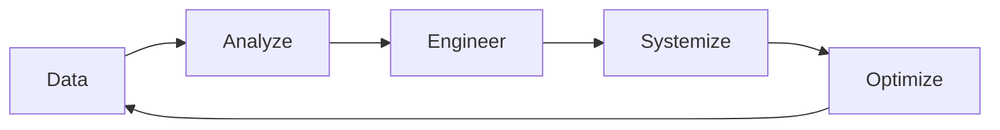

<div align="center">

</div>

# Playlist Haven - The Experience Engine Made Real

> *"I once saw a quote about how the difference between art shoved in the attic and art hung on your wall is experience. To have your art on the wall is to experience it. To find your art is to use the discovery engine; to stop there is to put it in the attic. To use the experience engine is to put your art on your wall and live with it."*

**Playlist Haven** is a premium, state-of-the-art mobile playlist utility suite built to empower music audiophiles to take back autonomy over their media libraries, resist algorithmic feed fatigue, and intentionally cultivate their own listening environments. It serves as the physical realization of the **Experience Engine**—a local-first "swiss army knife" designed to organize, sort, slice, and sieve music assets with absolute control.

---

## 🎧 My Story & Philosophy

For close to 5 years, I logged **over 10,000 hours of listening** and manually constructed **over 1,300 playlists**. My meticulous process was driven by a deep realization: mainstream streaming platforms are actively sabotaging our relationship with music. 

Streaming sites focus entirely on the **Discovery Engine**—deploying capitalistic, dopamine-driven recommendation algorithms built to feed us constant novelty and treat songs as short-play, disposable commodities. They hide our listening metrics, keep them behind paywalls, or parcel them out once a year in marketing campaigns.

**I built Playlist Haven to make the Experience Engine real.** It is built on the core belief that songs do *not* have short play values and that the ideal music experience must balance discovery with depth. By digitizing our music habits, we can establish the **DAESO Loop**:



This application was designed to serve as the technological engine for my music blog, where I explore the deep intersections of technology, listening autonomy, and the preservation of art:
*   **Read my essays on Substack**: [Playlist Haven / Experience Engine on Substack](https://your-username.substack.com) — *where I publish in-depth analyses on the digitization of the music experience, playlist functional layers, and curational metrics.*
*   **Follow my articles on Medium**: [Experience Engine Series on Medium](https://medium.com/@your-username) — *featuring long-form pieces on escaping cloud novelty loops and cultivating library depth.*

---

## 🌉 Bridging Walled Gardens: Streaming Extension Pipeline

mainstream streaming services (Spotify, YouTube Music, Apple Music) are walled gardens that restrict how you manage your music, offering zero advanced sorting, fuzzy pruning, multi-tier play-count filtering, or structural manipulation. 

**Playlist Haven acts as a bidirectional bridge that extends local desktop-grade power tools to your cloud streaming libraries:**

```
   ┌────────────────────────────────────────────────────────┐
   │            [ Walled Streaming Services ]               │
   │            (Spotify, YouTube Music, Apple)             │
   └───────────┬────────────────────────────────┬───────────┘
               │ (Export via third-party web    ▲ (Import manipulated CSVs
               │  tools like TuneMyMusic)       │  back to streaming lists)
               ▼                                │
   ┌────────────────────────────────────────────┴───────────┐
   │                [ Playlist Haven Engine ]               │
   │  Curate, Sieve, Deduplicate, Fuzzy Cross-Prune, Sort   │
   └───────────┬────────────────────────────────────────────┘
               │ (Port final sieved file)
               ▼
   ┌────────────────────────────────────────────────────────┐
   │            [ Autonomous Music Environments ]           │
   │     Musify (Free YouTube Streaming) / Musicolet        │
   └────────────────────────────────────────────────────────┘
```

### The Curation Workflow:
1.  **Extract**: Export your live Spotify or YouTube Music playlists as a CSV file using online synchronization tools (e.g., *Tune My Music* or *Soundiiz*).
2.  **Enhance**: Import the CSV into Playlist Haven's web suite. Apply dynamic play-count filters, run multiple randomizations, fuzzy-prune duplicates across different open lists, or sieve tracks based on play-history.
3.  **Synchronize**: Export the optimized CSV from Playlist Haven and upload it back to Spotify or YTM via the same sync tools—instantly extending local power-user sorting, sieving, and deduplication features directly to your live streaming experience.
4.  **Free-Stream Transition**: Alternatively, route sieved CSVs directly into **Musify** (which enables free streaming of YouTube content) or offline players like **Musicolet** (the legendary Android local file manager celebrating its 10th anniversary).

---

## 📱 Tailored Musicolet Integrations

**Musicolet** stands as the absolute gold standard for offline music library management, representing the ultimate tool for listeners who demand complete autonomy over their media. In celebration of **Musicolet's 10-Year Anniversary**, Playlist Haven is engineered specifically to interlock with the **two primary data export channels** Musicolet makes available, enabling a highly functional, offline-first curation ecosystem:

### 📊 Channel A: Songs CSV Exports (The Quantitative Core)
Musicolet's raw `.csv` music databases represent your objective play-history. Playlist Haven ingests these exports to perform precise mathematical library manipulations:
*   **Musicolet-Specific Headers**: The engine parses Musicolet's native CSV outputs, mapping `FILE_PATH` and `PLAY_COUNT` columns directly.
*   **BOM Handling**: Handles Musicolet's default UTF-8 Byte Order Mark (BOM) headers cleanly, ensuring track paths are not corrupted by hidden file markers during file-reading.
*   **Zero-Loss Metadata Preservation**: Caches all additional CSV metadata rows (artists, albums, duration, composers) to ensure sieved and edited files preserve exact original metadata blocks upon download.
*   **Timeframe-Bound Filename Tracking**: Recognizes and auto-increments the weekly naming convention:
    `Most played Songs • Week X - YYYY.csv` ──► `Most played Songs • Week X+1 - YYYY.csv`
*   **Parenthesized Play Tier Counter**: Appends your custom play count threshold statistics directly to the output filename in parentheses, e.g. `Most played Songs • Week 18 - 2026 (12).csv` where `12` represents the count of tracks at your exact play tier limit.

### 🎵 Channel B: M3U Playlist Exports (The Qualitative & Structural Core)
The foundational `.m3u` / `.m3u8` playlist format represents your active, human-curated music taste. Playlist Haven was designed around these files to make advanced playlist curation possible:
*   **Highly Portable M3U Metadata Parsing**: Playlist Haven extracts and writes standard `#EXTM3U` and `#EXTINF` metadata records, parsing durational metadata, titles, and artists smoothly.
*   **Preserving Android File Paths**: Successfully ingests and outputs custom, system-specific directories—including raw Android external/internal storage pathways (e.g. `Android/media/...`, `Music/SpotiFlyer/...`, `Download/...` or custom system music folders like `ultima/ultima/...`). This allows you to import manipulated playlists straight back into Musicolet's database with zero broken file paths.
*   **Conflict Resolution & Skeleton Anchor**: Solves play-count positional conflict. When dozens of tracks possess identical play-history scores, the M3U playlist export is utilized as a "skeleton anchor" to preserve the structural sequencing of your tracks and resolve rating position ties cleanly.

---

## 🔮 My Native Musicolet Dream & Future Roadmap

While Playlist Haven serves as a standalone web utility, my ultimate vision is **native integration**. Having manually curated over 1,300 playlists inside Musicolet over 5 years, I designed this application to act as both an open conceptual blueprint and an open invitation for future development:

*   **Unlocking the M3U Potential**: Musicolet is the undisputed king of offline playback, but what is **fundamentally missing is a powerful, deep way of working with playlists—specifically, unlocking the vast, untapped potential of native M3U playlist manipulation**. Playlists should not be static, isolated listings of files; they are active, dynamic layers of qualitative taste and structural experience.
*   **Direct Collaboration Invitation**: **I would absolutely love to collaborate directly with the Musicolet development team** to bring these features to life natively on Android. By integrating these advanced Experience Engine capabilities—such as automated play-count sieving, fuzzy cross-playlist duplicates pruning, and skeleton anchor conflict resolution—directly as native, on-device controls within Musicolet, we can revolutionize how offline libraries are managed.

By digitizing my meticulous curation rituals, I hope to inspire Musicolet's next decade of library management innovation and invite direct joint efforts to make this dream a reality.

*A massive salute of respect to the developers of Musicolet for a decade of empowering music curational autonomy worldwide!*

---

## 🛠️ Comprehensive Module Specifications

Playlist Haven features 10 specialized functional views, mapped directly to the **DAESO** playlist layers:

### 1. 🎛️ Sonic Sieve Logic Engine (`SonicSieveView.tsx`) [Integration Layer]
The ultimate weekly playlist generator that automates your listening rotation:
*   **Musicolet CSV & Classic M3U Modes**: Choose between raw M3U parsing and parsing Musicolet Songs CSV exports. Includes BOM (Byte Order Mark) stripping and quote-sanitized parsing to handle UTF-8/Windows-1252 character sets.
*   **The Quantitative Sieve**: Filter tracks using a dynamic play count threshold (customizable range, defaulting to my personal sweet spot of `≥ 2 plays`).
*   **The Skeleton Anchor**: When dozens of songs are tied at the exact same play count, typical sorters introduce noise and destroy positional memory. The Anchor playlist acts as a "skeleton," preserving your original structural order and inserting new, lower-ranked tracks cleanly at the end.
*   **Dynamic Filename Formatting**: Automatically matches the weekly `Week X - YYYY` format in the anchor filename, increments the week count, and appends the exact track count matching your play tier in parentheses, e.g., `Most played Songs • Week 18 - 2026 (12).csv`.
*   **Penalty Playlists**: Ingest one or more playlists/CSVs to deduct 1 play point per track per file (ideal for "Exclusion lists" or "Last Week's" plays).

### 2. 🎚️ Playlist Manipulator (`PlaylistManipulatorView.tsx`) [Analytic & Capture Layer]
An extensive interactive workbench to rearrange, slice, and cross-reference multiple playlists simultaneously:
*   **Fuzzy Cross-Prune**: Cross-reference multiple loaded playlists to identify and remove fuzzy duplicate matches across files using Jaro-Winkler bigram similarity with customizable matching strictness percentages.
*   **Play Count Filters**: Dynamically parses play statistics from CSV fields to let you select, deselect, replace, or intersect tracks using custom play-range boundaries—passing completely silently for files without play metadata.
*   **Interactive Drag-and-Drop Grid**: Move tracks manually with smooth drag previews and responsive container auto-scrolling.
*   **Numeric & Alphabetical Sorting**: One-click sorting by play count (Highest plays first) or alphabetical properties (Title, Artist, Album).
*   **Deduplication & Multiple-Shuffles**: Clean duplicate tracks instantly, invert selections, or perform complex randomizations to keep stale playlists fresh.

### 3. 🧩 Playlist Merger (`PlaylistMergerView.tsx`) [Storage Layer]
Merge multiple playlist files into cohesive groups:
*   **Standard Merge**: Combine multiple M3U or CSV files into a single unified playlist file, applying automatic deduplication.
*   **Timeframe Merge**: Detects date formats in filenames (using formats like `DD-MM-YY`, `YYYY-MM-DD`, etc.) and groups playlists into `Week`, `Month`, `Quarter`, or `Year` timeframes, generating a ZIP archive of individual merged playlists.

### 4. ✂️ Playlist Splitter (`PlaylistSplitterView.tsx`) [Storage Layer]
Divide a large playlist into equal smaller parts:
*   **Interactive Slices**: Input a custom division range (2 to 20 parts) and slice large lists while fully maintaining the original track ordering.

### 5. 🧽 Playlist Pruner (`PlaylistPrunerView.tsx`) [Analytic Layer]
Perform smart track exclusions:
*   **Exclusion Matrix**: Ingest a single "Source Playlist" (The Eraser) and multiple "Target Playlists" to strip out source tracks from target files instantly, outputting cleaned lists with detailed statistics.

### 6. 🎲 Playlist Randomizer (`PlaylistRandomizerView.tsx`) [Engineering Layer]
Apply advanced shuffling algorithms to playlist files:
*   **Weighted & Group Shuffling**: Supports randomizing tracks while keeping artists grouped, shuffling within custom segments, or executing complete shuffles to revive stale playlists.

### 7. 🏷️ Smart Renamer (`SmartRenamerView.tsx`) [Systemization Layer]
Perform batch modifications on track directories:
*   **Path Mapping**: Batch rename playlist directories, track file paths, titles, or tags with advanced string substitutions, casing shifts, prefixes, and suffixes.

### 8. 🎨 Playlist Appearance & Aesthetics (`PlaylistAppearanceView.tsx`) [Engineering Layer]
Edit metadata blocks like EXTINF tags, covers, playlist titles, file directory mappings, descriptions, and custom track titles.

### 9. 📊 Tier Filtering (`TierFilteringView.tsx`) [Analytic Layer]
Filter playlist tracks into distinct high, medium, or low tiers based on custom play count boundaries, exporting segmented tier files.

### 10. 👁️ Vision-To-Playlist (`VisionToPlaylistView.tsx`) [Capture Layer]
AI-assisted screenshot playlist converter. Upload images or screenshots of online playlists, and the visual engine will extract track titles and artists, automatically resolving them into clean, standards-compliant M3U or CSV files.

---

## 🛠️ Run Locally

**Prerequisites:** Node.js installed.

1.  **Install dependencies**:
    ```bash
    npm install
    ```
2.  **Configure AI Models (Universal & Local-First)**:
    Playlist Haven features a fully universal, provider-agnostic AI engine for Vision-to-Playlist conversions. You have complete freedom to choose your backend:
    *   **Option A: Cloud Models (Gemini)**:
        Create a `.env.local` file in the root directory and add your key:
        ```env
        VITE_GEMINI_API_KEY=your_gemini_api_key_here
        ```
    *   **Option B: Local Models (OpenAI-Compatible / Ollama / LM Studio)**:
        Playlist Haven supports **100% offline, local-first vision models** out of the box!
        *   Launch your local model server (e.g., `ollama run llama3.2-vision` or use LM Studio).
        *   In the app, click the Settings/AI gear to configure any custom `Base URL` (defaults to Ollama's `http://localhost:11434/v1`), specify your local `Model Name`, and toggle the provider to **OpenAI-Compatible**—no cloud key required!
3.  **Run Development Server**:
    ```bash
    npm run dev
    ```
4.  **Verify Production Compilation**:
    Verify asset bundling and TypeScript static analysis:
    ```bash
    npm run build
    ```

---

*“To use the experience engine is to put your art on your wall and experience it.”* 🎵
