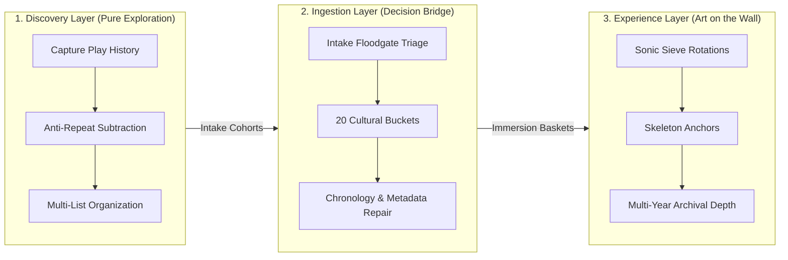

# 🎵 Playlist Haven — The Experience Engine Made Real

[](https://playlist-haven.vercel.app)
[](https://github.com/joejamal029/Playlist-Haven)
[](https://github.com/sponsors/joejamal029)
[](https://substack.com/@beyondshuffleandalgorithms)

> *"The difference between art shoved in the attic and art hung on your wall is experience. To have your art on the wall is to experience it. To find your art is to use the discovery engine; to stop there is to put it in the attic. To use the experience engine is to put your art on your wall and live with it."*

---

### 🚀 Quick Links & Documentation Hub
* 🌐 **[Launch Live Web App](https://playlist-haven.vercel.app)** *(100% Free, Zero-Install, Zero-Login, Runs Completely in Your Browser)*
* ⚡ **[High-Density Executive Summary](playlist_haven_high_density_summary.md)** *(A rapid 3-minute architectural briefing & system matrix)*
* 📘 **[Comprehensive System Brief](docs/PLAYLIST_HAVEN_SYSTEM_BRIEF.md)** *(Exhaustive 16-module technical specifications & protocols)*
* 💡 **[Essays on Beyond Shuffle & Algorithms](https://substack.com/@beyondshuffleandalgorithms)** *(Long-form explorations on music curation & tech autonomy)*

---

## 🎧 The Creed: Discovery Engine vs. Experience Engine

For close to 5 years, I logged **over 10,000 hours of listening** and manually constructed **over 1,300 playlists**. That journey led to a fundamental realization: mainstream streaming platforms are actively sabotaging our relationship with music.

Streaming platforms are built as **Discovery Engines**. They deploy dopamine-driven recommendation algorithms designed to serve constant novelty and treat songs as short-play, disposable commodities. Worse, they intentionally cripple library organization—forcing listeners into a restrictive **1-song / 1-playlist cage**, with zero multi-select, no simultaneous side-by-side list comparisons, no set math, and zero format freedom.

> *"With 10,000+ hours I thought I had seen it all, but I am truly in new terrains encountering new problems at never imagined scales."*

When you take back autonomy over your listening, you encounter a profound curatorial truth: **the ultimate music experience is an asymptote; you can love and resonate with an endless number of songs and artists. Only the right tools and organization levels will set you straight.**

Having a desktop-grade playlist manipulator embedded directly in your music app is the foundational reason Playlist Haven exists: breaking the 1-song / 1-playlist cage to curate, batch-edit, compare, and shape your library on your own terms.

---

## 🧬 The 3-Tier Musical Lifecycle

A song is not a disposable stream; it is a traveler moving through three distinct evolutionary layers, each powered by its own continuous **DAESO Loop** ($\text{Data} \rightarrow \text{Analyze} \rightarrow \text{Engineer} \rightarrow \text{Systemize} \rightarrow \text{Optimize}$):


```mermaid
graph LR
    subgraph L1["1. Discovery Layer (Pure Exploration)"]
        D1["Capture Play History"] --> D2["Anti-Repeat Subtraction"]
        D2 --> D3["Multi-List Organization"]
    end

    subgraph L2["2. Ingestion Layer (Decision Bridge)"]
        I1["Intake Floodgate Triage"] --> I2["20 Cultural Buckets"]
        I2 --> I3["Chronology & Metadata Repair"]
    end

    subgraph L3["3. Experience Layer (Art on the Wall)"]
        E1["Sonic Sieve Rotations"] --> E2["Skeleton Anchors"]
        E2 --> E3["Multi-Year Archival Depth"]
    end

    L1 -->|"Intake Cohorts"| L2
    L2 -->|"Immersion Baskets"| L3
```

1. **Layer 1: The Discovery Layer (Pure Unencountered Exploration)**  
   Captures listening history as foundational data enabling the DAESO loop. Governed by the **Playlist Manipulator (Module 4)** and **Playlist Matcher / Reconciler (Module 8)**—giving curators the sovereign freedom to batch-organize multi-source crates across 1, 2, or 4 panes, execute set math, and aggressively subtract already-played tracks and offline libraries so discovery remains 100% unencountered.
2. **Layer 2: The Ingestion Layer (The Decision Bridge & Intake Floodgate)**  
   Solves the "Intake Problem" when boundless discovery creates paralyzing volume. Personified by **Discovery Triage (Module 14)**, **Language Clustering (Module 13)**, **Deep Enrichment (Module 15)**, and **Playlist Resequencer (Module 16)**. Categorizes intake tracks into probe singles, magnet artists ($\ge 4$ songs), and validated albums ($\ge 2$ songs) with 1-click promotion, singlesification, and deferral.
3. **Layer 3: The Experience Layer (Living with Art on the Wall)**  
   Where songs achieve their qualitative and quantitative peak over months and years. Powered by the **Sonic Sieve (Module 1)**—the personal heartbeat where the DAESO loop originated—using objective play thresholds ($\ge 2$), spatial skeleton anchors, and local-first integration with **Musicolet** (Android).

---

## 🖼️ Application Interface

<table align="center">
  <tr>
    <td colspan="2" align="center"><b>Playlist Haven Dashboard & Interactive User Guide</b><br/></td>
  </tr>
  <tr>
    <td><b>Playlist Manipulator (Single, Dual & 4-Pane Quad Modes)</b><br/></td>
    <td><b>Vision-to-Playlist (AI Cloud & Local Ollama)</b><br/></td>
  </tr>
  <tr>
    <td><b>Scrape Stripper & Formatter (BOM & Presets)</b><br/></td>
    <td><b>Playlist Merger & Time-Grouping</b><br/></td>
  </tr>
</table>

---

## 🎯 What Playlist Haven Solves ("Jobs to Be Done")

Instead of getting lost in technical jargon, here is how Playlist Haven solves real, everyday music curation challenges across each stage of your musical lifecycle:

### 🔍 Layer 1: Discovery Jobs (Unencountered Exploration & Crate Digging)
| Real-World Role / Curation Challenge | How Playlist Haven Solves It | Core Engine |
| :--- | :--- | :--- |
| **The Sovereign Curator (Breaking the 1-Song / 1-Playlist Cage):**<br/>*"Streaming platforms trap you in a 1-song / 1-playlist cage—you can only view one list at a time, moving songs in bulk is painful, and comparing or combining playlists takes endless manual work."* | **The Genesis & Crown Jewel of Playlist Haven (True Organizational Sovereignty):**<br/>• **Multi-Pane Workspace**: View and organize 1, 2, or 4 playlists side-by-side on a single screen without jumping between tabs.<br/>• **Effortless Batch Actions**: Select ranges of songs, invert selections, bulk-move tracks to the top or bottom, and drag-and-drop between playlists.<br/>• **Instant Filters**: Quickly filter any playlist by Artist, Album, or Play Count.<br/>• **Merge, Compare & Subtract**: Instantly combine playlists, isolate overlapping tracks, or subtract one list from another to extract only brand-new music.<br/>• **Smart Duplicate Cleaning**: Automatically detect and purge duplicate tracks across playlists—even with spelling quirks or remaster tags—with an adjustable similarity slider. | **4. Playlist Manipulator (Single, Dual & Quad 4-Pane)** |
| **The Sovereign Purifier (Pure Discovery & Spiced Flow):**<br/>*"I want to audition a fresh discovery batch without hearing tracks I already know, and spice up my listening with a genuine shuffle that keeps the flow diverse."* | • **Anti-Repeat Crate Subtraction**: Automatically compares incoming discovery lists against your library and past listening history to filter out familiar tracks, guaranteeing 100% fresh discovery.<br/>• **True Shuffle & Spiced Flow**: Spices up your playlist with genuine shuffle that spaces out artists evenly—unlike streaming apps where re-shuffling an active queue constantly pulls already-played songs right back in. | **8. Playlist Matcher / Reconciler & 10. Playlist Randomizer** |
| **The Visual Playlist Bridge (Screenshots to Playable Lists):**<br/>*"I have screenshots of playlists from friends, social media, or an offline player with no export option—or photos of festival flyers—and I can't bridge them to streaming without typing every song by hand."* | Instantly turns screenshots and photos into clean `.csv` and `.m3u` playlists—saving hours of manual retyping. Rescues music trapped in offline players with no export button, and creates ready-to-import files that feed directly into transfer tools like **TuneMyMusic** or **Soundiiz** to instantly rebuild your playlists on Spotify, Apple Music, or YouTube Music (runs via Cloud Gemini or 100% offline local AI). | **11. Vision-to-Playlist AI** |
| **The Tastemaker & Crate-Digger (True 'Best-Of' Synthesis):**<br/>*"I want to find an artist's true consensus masterpieces across deep discographies, not Spotify's sponsored tracks."* | **Consensus Aggregator**: Cross-tabulates multiple crowdsourced 'Best Of' playlists and fan setlists to identify the most recurrent, universally acclaimed tracks. | **11. Consensus Aggregator** |
| **The Boiler Room / Mix Tape Archivist (Web Dump Sanitizer):**<br/>*"I copied a raw tracklist from a YouTube DJ set or blog, and it's choked with timestamps, video tags, and flipped artist names."* | Strips video noise (`[MV]`, `1080p`, `Lyrics`, timestamps), cleans sidebar leaks, handles CJK character syntax, and inverts `Artist ↔ Title` orientations with 1 click. | **12. Scrape Stripper & Formatter** |

### 🌉 Layer 2: Ingestion Jobs (Taming the Intake Floodgate & Decision Bridge)
| Real-World Role / Curation Challenge | How Playlist Haven Solves It | Core Engine |
| :--- | :--- | :--- |
| **The Floodgate Tamer (Decision Fatigue):**<br/>*"I discovered 150 songs this month and feel total decision paralysis (The Intake Problem)."* | Tri-Philosophy intake engine: isolates **Singles (The Probe)**, clusters **Artists (Magnet $\ge 4$ vs. Emerging 2–3)**, and validates **Albums ($\ge 2$)** with 1-click batch promotion, singlesification, and deferral. | **14. Discovery Triage** |
| **The Global & Diaspora Curator:**<br/>*"Streaming algorithms shove all non-Western music into lazy 'World' or generic 'Pop' buckets."* | Partitions thousands of tracks into **20 authentic cultural and linguistic cohorts** (Naija, J-Pop, K-Pop, Français, C-Pop, etc.) via a 5-tier waterfall engine. | **13. Language Clustering** |
| **The Cross-Platform Migrator:**<br/>*"I converted my YouTube discovery queue to Spotify, and the chronological discovery order got completely scrambled."* | Restores authentic chronological discovery sequence using title-guarded matching and a 10-category AI musicological resolver. | **16. Playlist Resequencer** |
| **The Musicologist & Metadata Purist:**<br/>*"I want real songwriting credits, true release dates, and high-res cover art."* | Links your library directly to MusicBrainz, Cover Art Archive, and Wikidata with full Work entity traversal and decoupled AI remediation. | **15. Deep Metadata Enrichment** |

### 🖼️ Layer 3: Experience Jobs (Living with Art on the Wall)
| Real-World Role / Curation Challenge | How Playlist Haven Solves It | Core Engine |
| :--- | :--- | :--- |
| **The Active Rotation Listener:**<br/>*"I want a self-refreshing weekly rotation based on what I actually listen to, without familiar songs jumping around randomly."* | *(Requires a data-capable music app like Musicolet or Last.fm CSV export)* Dynamically sieves tracks by objective play count ($\ge 2$) while using previous playlists as **Skeleton Anchors** to preserve human spatial memory. | **1. Sonic Sieve Engine** |
| **The Long-Term Audiophile:**<br/>*"I want to see how my listening actually tiers out over time and separate eternal staples from fleeting one-week obsessions."* | Slices multi-thousand song databases into targeted play-count tiers (Tier 1: 50+, Tier 2: 20–49, Tier 3: 5–19) and audits longitudinal multi-year recurrence with frequency histograms. | **3. Tier Filtering & 5. Appearance Counter** |
| **The Library Groomer:**<br/>*"My library is a cluttered mess of fragmented weekly files, duplicate tracks, noisy video titles, and massive 2,000-song playlists that lag my device."* | Complete library hygiene: consolidates timeframes (Weekly $\rightarrow$ Monthly $\rightarrow$ Yearly), splits monster lists into numbered chapters (`Part 1`, `Part 2`), cleans tag noise via regex (Smart Renamer), and cross-prunes duplicates with fuzzy matching. | **6. Merger, 7. Splitter, 9. Smart Renamer & 4. Manipulator (Pruner)** |
| **The Offline Collector:**<br/>*"I have curated playlists on streaming, but I want to play them 100% offline from physical files on my local hard drive."* | Fuzzy-matches online streaming tracklists against physical local audio folders (`.mp3`/`.flac`) using Jaro-Winkler bigram similarity to produce 100% playable local `.m3u` playlists for Musicolet and offline audiophile players. | **8. Offline Matcher / Reconciler** |

<details>
<summary><b>🛠️ Click to expand the 16-Module Functional Directory by Lifecycle Layer</b></summary>

<br/>

#### Layer 1: Discovery & Acquisition Modules
* **Vision-to-Playlist AI** (`VisionToPlaylistView.tsx`): Turns screenshots and photos of playlists into clean CSV/M3U files for offline listening or TuneMyMusic streaming imports.
* **Scrape Stripper & Formatter** (`ScrapeStripperView.tsx`): Sanitizes messy YouTube and web scrapes into clean UTF-8 BOM CSVs.
* **Playlist Manipulator (Quad View)** (`PlaylistManipulatorView.tsx`): 1/2/4-pane multi-list organizer with fuzzy Jaro-Winkler cross-pruning.
* **Smart Renamer & Tag Editor** (`SmartRenamerView.tsx`): Batch metadata sanitizer with regex find/replace and musical acronym preservation.
* **Playlist Randomizer** (`PlaylistRandomizerView.tsx`): Cryptographic shuffle enforcing artist separation spacing.

#### Layer 2: Ingestion & Cultural Bridge Modules
* **Discovery Triage & Honing** (`DiscoveryTriageView.tsx`): High-agency intake hub for singles, resonance artists, and validated albums.
* **Language & Cultural Clustering** (`LanguageClusteringView.tsx`): 5-tier waterfall engine partitioning libraries into 20 canonical cultural buckets.
* **Playlist Resequencer & Chronology Restorer** (`PlaylistResequencerView.tsx`): Repairs scrambled track order from cross-platform conversions.
* **Deep Metadata Enrichment** (`DeepMetadataEnrichmentView.tsx`): MusicBrainz knowledge graph integration with Work entity songwriting traversal.

#### Layer 3: Experience, Rotation & Archival Modules
* **Sonic Sieve Engine** (`SonicSieveView.tsx`): Weekly listening rotation generator with play-count sieving, skeleton anchors, and penalty lists.
* **Sonic Sieve 2 (Dual Input)** (`SonicSieveView2.tsx`): Comparative dual-playlist siever resolving relative play frequencies.
* **Tier Filtering Workbench** (`TierFilteringView.tsx`): Statistical library slicing into heavy rotation, moderate, and exploration tiers.
* **Appearance Counter** (`PlaylistAppearanceView.tsx`): Historical recurrence audit separating library staples from one-off plays.
* **Playlist Merger & Grouping** (`PlaylistMergerView.tsx`): Temporal consolidation into weekly, monthly, and yearly chronological archives.
* **Playlist Splitter** (`PlaylistSplitterView.tsx`): Decomposes monolithic 2,000+ track playlists into sequential numbered chapters.
* **Playlist Matcher / Reconciler** (`PlaylistMatcherView.tsx`): Bridges streaming tracklists to local physical `.mp3`/`.flac` hard drive storage.

> *Future Roadmap*: Ongoing development includes decoupling the **Consensus Aggregator** (crowdsourced 'Best Of' cross-tabulation) into a dedicated standalone module, and packaging basic list transformations into a standalone manipulation suite.

*For complete technical architecture, API schemas, and mathematical specifications, see the [Comprehensive System Brief](docs/PLAYLIST_HAVEN_SYSTEM_BRIEF.md).*

</details>

---

## 🌉 Bridging Walled Gardens: The 3-Step Universal Loop

Streaming platforms (Spotify, Apple Music, YouTube Music) keep your listening data locked in their ecosystem. Playlist Haven acts as a **bidirectional bridge**:

```
   ┌────────────────────────────────────────────────────────┐
   │            [ Walled Streaming Services ]               │
   │            (Spotify, YouTube Music, Apple)             │
   └───────────┬────────────────────────────────┬───────────┘
               │ (1. Export CSV via             ▲ (3. Re-import clean CSV
               │  TuneMyMusic or scrapers)      │  back to streaming)
               ▼                                │
   ┌────────────────────────────────────────────┴───────────┐
   │                [ Playlist Haven Engine ]               │
   │   Sieve, Deduplicate, Cluster by Culture, Triage       │
   └───────────┬────────────────────────────────────────────┘
               │ (3. Or port clean M3U/CSV)
               ▼
   ┌────────────────────────────────────────────────────────┐
   │            [ Autonomous Music Environments ]           │
   │      Musicolet (Android) / Musify (Free YT Streaming)  │
   └────────────────────────────────────────────────────────┘
```

1. **Extract**: Export your live Spotify, Apple, or YouTube Music playlist as `.csv` or `.txt` using free utilities like TuneMyMusic, Soundiiz, or browser scrapers.
2. **Curate**: Open Playlist Haven in your browser. Apply desktop-grade power tools—sieve by play history, cluster by language, prune duplicates, or restore chronological order.
3. **Synchronize & Experience**:
   * **Back to Streaming**: Export an optimized **UTF-8 BOM CSV** and sync it back to Spotify.
   * **Into Autonomous Players**: Drop the clean `.m3u` directly into **Musicolet** (Android) or **Musify** for 100% offline, algorithm-free listening.

---

## 📱 Tailored for Offline Audiophiles: Musicolet Integrations

**Musicolet** is the undisputed gold standard for offline mobile music playback. In celebration of **Musicolet's 10-Year Anniversary**, Playlist Haven is specifically engineered to interface with Musicolet's core data channels:

* **📊 Channel A: Songs CSV (Quantitative Core)**: Ingests Musicolet's `Songs.csv` database, reads `FILE_PATH` and `PLAY_COUNT` columns with zero metadata loss, recognizes weekly increments (`Week 18` $\rightarrow$ `Week 19`), and appends play tier counts in parentheses, e.g. `Most played Songs • Week 19 - 2026 (12).csv`.
* **🎵 Channel B: M3U Playlists (Qualitative & Structural Core)**: Parses `#EXTINF` metadata and raw Android file paths (e.g. `/storage/emulated/0/Music/...`). When multiple songs share identical play counts, previous M3U playlists are used as **Skeleton Anchors** to preserve human sequencing memory.
* **📄 Channel C: Plain Text Song Lists**: Clean `[Title] - [Artist]` cataloging with hyphen-safe parsing.

> **💡 The Native Musicolet Vision**: Playlist Haven serves as both a live utility and an open conceptual blueprint. We warmly welcome collaboration with the Musicolet engineering team to bring these advanced playlist sieving and conflict-resolution capabilities into native Android controls.

---

## 🧭 Choose Your Path: Curators vs. Developers

### 🎧 For Music Lovers & Curators
* **Zero Installation**: Open **[playlist-haven.vercel.app](https://playlist-haven.vercel.app)** in any modern browser on desktop or mobile.
* **100% Client-Side Privacy**: Your audio files, playlists, and listening habits **never leave your device**. No server databases, no accounts, no tracking.
* **Interactive Help Guide**: Press <kbd>?</kbd> or click the **Guide (?)** button anywhere in the app to search workflows, FAQs, and file specifications.

### 💻 For Developers & Self-Hosters
Playlist Haven is built with **React 18**, **TypeScript**, **Vite**, and **Tailwind CSS**. It compiles to a static SPA deployed effortlessly to Vercel, Netlify, or GitHub Pages.

#### ⚡ 1-Click Startup (Windows)
Double-click `launch.bat` in the project root to install dependencies, boot Vite, and launch `http://localhost:3000`.

#### 💻 Manual Command Line
```bash
# 1. Clone repository
git clone https://github.com/joejamal029/Playlist-Haven.git
cd Playlist-Haven

# 2. Install dependencies
npm install

# 3. (Optional) Configure Google Gemini API Key in .env.local
# VITE_GEMINI_API_KEY=your_key_here

# 4. Run development server
npm run dev

# 5. Build production bundle
npm run build

# 6. (Optional) Sync to native Android via Capacitor
npm run android:build
```

#### 🔒 100% Offline Local AI (Ollama / LM Studio)
Playlist Haven supports local-first vision and language models out of the box!
1. Start your local server (e.g., `ollama run llama3.2-vision`).
2. In the app settings, set the Base URL to `http://localhost:11434/v1` and toggle to **OpenAI-Compatible**—zero cloud keys or internet connection required.

---

## 📚 Deep Technical Documentation

For deeper architecture diagrams, database schemas, and mathematical specifications:
* ⚡ **[High-Density Executive Summary](playlist_haven_high_density_summary.md)**: Architectural briefing, 16-module matrix, failover ceilings, and benchmark guarantees.
* 📘 **[Comprehensive System Brief](docs/PLAYLIST_HAVEN_SYSTEM_BRIEF.md)**: Master engineering manual detailing all 16 modules, IndexedDB object stores, MusicBrainz Work entity traversal, and defensive null-safety standards.

---

## ✍️ Author, Essays & Community

* **Substack Publication**: [Beyond Shuffle & Algorithms on Substack](https://substack.com/@beyondshuffleandalgorithms)
* **Medium Publication**: [Beyond Shuffle & Algorithms on Medium](https://beyondshuffleandalgorithms.medium.com/)
* **GitHub Sponsors**: [Support Ongoing Development](https://github.com/sponsors/joejamal029)

*“To use the experience engine is to put your art on your wall and live with it.”* 🎵
