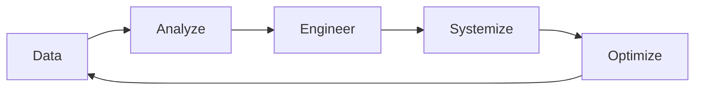

# Playlist Haven - The Experience Engine Made Real

[](https://playlist-haven.vercel.app)
[](https://github.com/joejamal029/Playlist-Haven)
[](https://github.com/sponsors/joejamal029)
[](https://substack.com/@beyondshuffleandalgorithms)

> *"I once saw a quote about how the difference between art shoved in the attic and art hung on your wall is experience. To have your art on the wall is to experience it. To find your art is to use the discovery engine; to stop there is to put it in the attic. To use the experience engine is to put your art on your wall and live with it."*

**Playlist Haven** is a premium, state-of-the-art playlist utility suite built to empower music audiophiles to take back autonomy over their media libraries, resist algorithmic feed fatigue, and intentionally cultivate their own listening environments. It serves as the physical realization of the **Experience Engine**—a local-first "swiss army knife" designed to organize, sort, slice, sieve, and bridge music assets with absolute desktop-grade control.

---

## 🎧 My Story & Philosophy

For close to 5 years, I logged **over 10,000 hours of listening** and manually constructed **over 1,300 playlists**. My meticulous process was driven by a deep realization: mainstream streaming platforms are actively sabotaging our relationship with music. 

Streaming sites focus entirely on the **Discovery Engine**—deploying capitalistic, dopamine-driven recommendation algorithms built to feed us constant novelty and treat songs as short-play, disposable commodities. They hide our listening metrics, keep them behind paywalls, or parcel them out once a year in marketing campaigns.

**I built Playlist Haven to make the Experience Engine real.** It is built on the core belief that songs do *not* have short play values and that the ideal music experience must balance discovery with depth. By digitizing our music habits, we can establish the **DAESO Loop**:


```mermaid
graph LR
    A[Data] --> B[Analyze]
    B --> C[Engineer]
    C --> D[Systemize]
    D --> E[Optimize]
    E --> A
```

This application was designed to serve as the technological engine for my music blog, **Beyond Shuffle & Algorithms**, where I explore the deep intersections of technology, listening autonomy, playlist functional layers, and the preservation of art in an age of algorithmic feed fatigue. 

*   **Substack Publication**: [Beyond Shuffle & Algorithms on Substack](https://substack.com/@beyondshuffleandalgorithms)
*   **Medium Essays**: [Beyond Shuffle & Algorithms on Medium](https://beyondshuffleandalgorithms.medium.com/)
*   **GitHub Sponsors**: [Support the Developer on GitHub Sponsors](https://github.com/sponsors/joejamal029)

---

## 🖼️ Application Interface & Features

<table align="center">
  <tr>
    <td colspan="2" align="center"><b>Playlist Haven Dashboard & Help Guide</b><br/></td>
  </tr>
  <tr>
    <td><b>Playlist Manipulator (Single, Dual & 4-Pane Quad Modes)</b><br/></td>
    <td><b>Vision-to-Playlist (AI Cloud & Local Ollama)</b><br/></td>
  </tr>
  <tr>
    <td><b>Scrape Stripper & Formatter (BOM & Presets)</b><br/></td>
    <td><b>Playlist Merger & Time-Grouping</b><br/></td>
  </tr>
</table>

---

## 💡 Searchable Interactive Help & Philosophy Modal (`?`)

Anyone exploring the application can press the **`Guide (?)`** button in the header, click the **New to Playlist Haven? Quick Tour (?)** banner, or press <kbd>?</kbd> / <kbd>Shift</kbd> + <kbd>?</kbd> from anywhere to open the comprehensive user guide:

*   **1. 💡 Why Playlist Haven (Philosophy Tab)**: In-depth essays on the Experience Engine creed, breaking streaming walled gardens, the DAESO curation cycle, and representing regional & Chinese/CJK artists.
*   **2. 🚀 Quick Start & Workflows**: Step-by-step guides for bridging walled gardens, 60-second YouTube-to-Spotify scrapes, weekly Musicolet rotation sieving, Vision AI digitizing, and Language & Nationality library clustering.
*   **3. 🎛️ Tool-by-Tool Guide**: Detailed interactive breakdowns for all 16 modules.
*   **4. 📖 Formats & Glossary**: Complete specifications for M3U/M3U8 `#EXTINF`, Songs CSV, plain text tracklists, UTF-8 BOM (`\uFEFF`), and Jaro-Winkler bigram similarity.
*   **5. ❓ FAQ & Troubleshooting**: Practical answers covering browser automation scripts, offline LLMs, and Excel encoding.
*   **🔍 Instant Multi-Field Search Engine**: Search across questions, answers, tool names, and tags (`#spotify`, `#scrape`, `#cjk`, `#bom`, `#musicolet`, `#sieve`, `#ollama`, `#language`, `#clustering`, `#enrichment`, `#musicbrainz`, `#indexeddb`).

---

## 🌉 Bridging Walled Gardens: Streaming Extension Pipeline

Mainstream streaming services (Spotify, YouTube Music, Apple Music) are walled gardens that restrict how you manage your music, offering zero advanced sorting, fuzzy pruning, multi-tier play-count filtering, or structural manipulation. 

**Playlist Haven acts as a bidirectional bridge that extends local desktop-grade power tools to your cloud streaming libraries:**

```
   ┌────────────────────────────────────────────────────────┐
   │            [ Walled Streaming Services ]               │
   │            (Spotify, YouTube Music, Apple)             │
   └───────────┬────────────────────────────────┬───────────┘
               │ (Export via third-party web    ▲ (Import manipulated CSVs
               │  tools like TuneMyMusic)       │  back to streaming lists)
               ▼                                │
   ┌────────────────────────────────────────────┴───────────┐
   │                [ Playlist Haven Engine ]               │
   │  Curate, Sieve, Deduplicate, Fuzzy Cross-Prune, Sort   │
   └───────────┬────────────────────────────────────────────┘
               │ (Port final sieved file)
               ▼
   ┌────────────────────────────────────────────────────────┐
   │            [ Autonomous Music Environments ]           │
   │     Musify (Free YouTube Streaming) / Musicolet        │
   └────────────────────────────────────────────────────────┘
```

### The 4-Step Universal Extension Loop:
1.  **Extract**: Export your live Spotify, Apple Music, or YouTube Music playlists as a `.csv` or `.txt` file using online synchronization tools (e.g., *Tune My Music* or *Soundiiz*) or browser text scrapers.
2.  **Transform**: Import the CSV into Playlist Haven's web suite. Apply dynamic play-count filters, run multi-pane quad view manipulations, fuzzy-prune duplicates across different open lists, or sieve tracks based on play-history.
3.  **Synchronize**: Export the optimized **UTF-8 BOM CSV** from Playlist Haven and upload it back to Spotify or YTM via the same sync tools—instantly extending local power-user sorting, sieving, and deduplication features directly to your live streaming experience.
4.  **Autonomous Transition**: Alternatively, route sieved CSVs directly into **Musify** (which enables free streaming of YouTube content) or offline players like **Musicolet** (the legendary Android local file manager celebrating its 10th anniversary).

---

## 📱 Tailored Musicolet Integrations

**Musicolet** stands as the absolute gold standard for offline music library management, representing the ultimate tool for listeners who demand complete autonomy over their media. In celebration of **Musicolet's 10-Year Anniversary**, Playlist Haven is engineered specifically to interlock with the **two primary data export channels** Musicolet makes available, enabling a highly functional, offline-first curation ecosystem:

### 📊 Channel A: Songs CSV Exports (The Quantitative Core)
Musicolet's raw `.csv` music databases represent your objective play-history. Playlist Haven ingests these exports to perform precise mathematical library manipulations:
*   **Musicolet-Specific Headers**: The engine parses Musicolet's native CSV outputs, mapping `FILE_PATH` and `PLAY_COUNT` columns directly.
*   **BOM Handling**: Handles Musicolet's default UTF-8 Byte Order Mark (BOM) headers cleanly, ensuring track paths are not corrupted by hidden file markers during file-reading.
*   **Zero-Loss Metadata Preservation**: Caches all additional CSV metadata rows (artists, albums, duration, composers) to ensure sieved and edited files preserve exact original metadata blocks upon download.
*   **Timeframe-Bound Filename Tracking**: Recognizes and auto-increments the weekly naming convention:
    `Most played Songs • Week X - YYYY.csv` ──► `Most played Songs • Week X+1 - YYYY.csv`
*   **Parenthesized Play Tier Counter**: Appends your custom play count threshold statistics directly to the output filename in parentheses, e.g. `Most played Songs • Week 18 - 2026 (12).csv` where `12` represents the count of tracks at your exact play tier limit.

### 🎵 Channel B: M3U Playlist Exports (The Qualitative & Structural Core)
The foundational `.m3u` / `.m3u8` playlist format represents your active, human-curated music taste. Playlist Haven was designed around these files to make advanced playlist curation possible:
*   **Highly Portable M3U Metadata Parsing**: Playlist Haven extracts and writes standard `#EXTM3U` and `#EXTINF` metadata records, parsing durational metadata, titles, and artists smoothly.
*   **Preserving Android File Paths**: Successfully ingests and outputs custom, system-specific directories—including raw Android external/internal storage pathways (e.g. `Android/media/...`, `Music/SpotiFlyer/...`, `Download/...` or custom system music folders like `ultima/ultima/...`). This allows you to import manipulated playlists straight back into Musicolet's database with zero broken file paths.
*   **Conflict Resolution & Skeleton Anchor**: Solves play-count positional conflict. When dozens of tracks possess identical play-history scores, the M3U playlist export is utilized as a "skeleton anchor" to preserve the structural sequencing of your tracks and resolve rating position ties cleanly.

### 📄 Channel C: Plain Text Song Lists (The Text-Based Catalog)
Simple `.txt` file representations containing track records formatted as `[Title] - [Artist]` line-by-line are fully supported:
*   **Intelligent Separator Parsing**: Splits track entries using `lastIndexOf(' - ')` to correctly isolate the artist name on the right, preserving version tags, cover tags, and sub-titles containing hyphens in the song title.
*   **Fuzzy and AI Matching**: Can be matched directly against offline files and library databases in the Reconciler (Offline Playlist Matcher) to resolve local paths.
*   **Dual-Export Actions**: Can be manipulated and exported back to clean `.txt` song lists, or converted directly into standard playable `.m3u` playlists.

---

## 🔮 My Native Musicolet Dream & Future Roadmap

While Playlist Haven serves as a standalone web utility, my ultimate vision is **native integration**. Having manually curated over 1,300 playlists inside Musicolet over 5 years, I designed this application to act as both an open conceptual blueprint and an open invitation for future development:

*   **Unlocking the M3U Potential**: Musicolet is the undisputed king of offline playback, but what is **fundamentally missing is a powerful, deep way of working with playlists—specifically, unlocking the vast, untapped potential of native M3U playlist manipulation**. Playlists should not be static, isolated listings of files; they are active, dynamic layers of qualitative taste and structural experience.
*   **Direct Collaboration Invitation**: **I would absolutely love to collaborate directly with the Musicolet development team** to bring these features to life natively on Android. By integrating these advanced Experience Engine capabilities—such as automated play-count sieving, fuzzy cross-playlist duplicates pruning, and skeleton anchor conflict resolution—directly as native, on-device controls within Musicolet, we can revolutionize how offline libraries are managed.

---

## 🛠️ Comprehensive Module Specifications

Playlist Haven features 16 specialized functional views, mapped directly to the **DAESO** playlist layers:

### 1. 🎛️ Sonic Sieve Logic Engine (`SonicSieveView.tsx`) [Integration Layer]
The ultimate weekly playlist generator that automates your listening rotation:
*   **Musicolet CSV & Classic M3U Modes**: Choose between raw M3U parsing and parsing Musicolet Songs CSV exports. Includes BOM (Byte Order Mark) stripping and quote-sanitized parsing to handle UTF-8/Windows-1252 character sets.
*   **The Quantitative Sieve**: Filter tracks using a dynamic play count threshold (customizable range, defaulting to my personal sweet spot of `≥ 2 plays`).
*   **The Skeleton Anchor**: When dozens of songs are tied at the exact same play count, typical sorters introduce noise and destroy positional memory. The Anchor playlist acts as a "skeleton," preserving your original structural order and inserting new, lower-ranked tracks cleanly at the end.
*   **Dynamic Filename Formatting**: Automatically matches the weekly `Week X - YYYY` format in the anchor filename, increments the week count, and appends the exact track count matching your play tier in parentheses, e.g., `Most played Songs • Week 18 - 2026 (12).csv`.
*   **Penalty Playlists**: Ingest one or more playlists/CSVs to deduct 1 play point per track per file (ideal for "Exclusion lists" or "Last Week's" plays).

### 2. 🎚️ Playlist Manipulator (`PlaylistManipulatorView.tsx`) [Analytic & Capture Layer]
An extensive interactive workbench to rearrange, slice, and cross-reference multiple M3U, CSV, or TXT playlists simultaneously:
*   **Multi-Pane Layout Support (1, 2, or 4 Viewing Panes)**: Toggle between Single-Pane, Dual-Pane, or 4-Pane Quad View modes to view and manipulate up to 4 distinct playlist files side-by-side.
*   **Universal Toolbar Features**: Universal Move Top, Move Bottom, Cross-Prune, Combine, and Copy To across single-pane and multi-pane views.
*   **Fuzzy Cross-Prune**: Cross-reference multiple loaded playlists to identify and remove fuzzy duplicate matches across files using Jaro-Winkler bigram similarity with customizable matching strictness percentages.
*   **Plain Text Support**: Upload plain text track lists (`.txt` files formatted as `Title - Artist`). Rearrange or sort them, and export them back to clean text lists or convert them directly to standard playable M3U playlists.
*   **Play Count Filters**: Dynamically parses play statistics from CSV fields to let you select, deselect, replace, or intersect tracks using custom play-range boundaries—passing completely silently for files without play metadata.
*   **Interactive Drag-and-Drop Grid**: Move tracks manually with smooth drag previews and responsive container auto-scrolling.
*   **Numeric & Alphabetical Sorting**: One-click sorting by play count (Highest plays first) or alphabetical properties (Title, Artist, Album).
*   **Deduplication & Multiple-Shuffles**: Clean duplicate tracks instantly, invert selections, or perform complex randomizations to keep stale playlists fresh.

### 3. 🧩 Playlist Merger (`PlaylistMergerView.tsx`) [Storage Layer]
Merge multiple playlist files into cohesive groups:
*   **Standard Merge**: Combine multiple M3U or CSV files into a single unified playlist file, applying automatic deduplication.
*   **Timeframe Merge**: Detects date formats in filenames (using formats like `DD-MM-YY`, `YYYY-MM-DD`, etc.) and groups playlists into `Week`, `Month`, `Quarter`, or `Year` timeframes, generating a ZIP archive of individual merged playlists.

### 4. ✂️ Playlist Splitter (`PlaylistSplitterView.tsx`) [Storage Layer]
Divide a large playlist into equal smaller parts:
*   **Interactive Slices**: Input a custom division range (2 to 20 parts) and slice large lists while fully maintaining the original track ordering.

### 5. 🧽 Playlist Pruner (`PlaylistPrunerView.tsx`) [Analytic Layer]
Perform smart track exclusions:
*   **Exclusion Matrix**: Ingest a single "Source Playlist" (The Eraser) and multiple "Target Playlists" to strip out source tracks from target files instantly, outputting cleaned lists with detailed statistics.

### 6. 🎲 Playlist Randomizer (`PlaylistRandomizerView.tsx`) [Engineering Layer]
Apply advanced shuffling algorithms to playlist files:
*   **Weighted & Group Shuffling**: Supports randomizing tracks while keeping artists grouped, shuffling within custom segments, or executing complete shuffles to revive stale playlists.

### 7. 🏷️ Smart Renamer (`SmartRenamerView.tsx`) [Systemization Layer]
Perform batch modifications on track directories:
*   **Path Mapping**: Batch rename playlist directories, track file paths, titles, or tags with advanced string substitutions, casing shifts, prefixes, and suffixes.

### 8. 🎨 Playlist Appearance & Aesthetics (`PlaylistAppearanceView.tsx`) [Engineering Layer]
Edit metadata blocks like EXTINF tags, covers, playlist titles, file directory mappings, descriptions, and custom track titles.

### 9. 📊 Tier Filtering (`TierFilteringView.tsx`) [Analytic Layer]
Filter playlist tracks into distinct high, medium, or low tiers based on custom play count boundaries, exporting segmented tier files.

### 10. 👁️ Vision-To-Playlist (`VisionToPlaylistView.tsx`) [Capture Layer]
AI-assisted screenshot playlist converter. Upload images or screenshots of online playlists, and the visual engine will extract track titles and artists, automatically resolving them into clean, standards-compliant M3U or CSV files. Supports Cloud (Gemini) and 100% offline local vision models (Ollama / LM Studio).

### 11. 🔗 Offline Playlist Matcher & Reconciler (`PlaylistMatcherView.tsx`) [Integration & Capture Layer]
Reconcile and align tracklist variations between a shared playlist (M3U, CSV, or TXT) and your local library database:
*   **Fuzzy Bigram Similarity**: Automatically maps matching titles and artists using robust Jaro-Winkler string-cleaning and bigram score comparison.
*   **AI Assist Lookup**: Send low-confidence candidate tracks in token-optimized chunks to Gemini to identify and match the correct candidate.
*   **Real-time Searchable Resolution Overlay**: Quickly search your entire library database inline to manually assign matches for unresolved tracks.
*   **Export Options**: Download a playable local M3U playlist with your local file paths, or export a CSV list of all missing songs.

### 12. 🪄 Scrape Stripper & Formatter (`ScrapeStripperView.tsx`) [Capture & Curation Layer]
Standardized, automated YouTube channel and playlist scrape parser & formatter:
*   **Standardized Manual & Automated Scrape Parser**: Ingests raw text dumps from YouTube channel pages, playlists, and browser scrapes (supports leading durations or compact formats, with zero header noise).
*   **Automated Recommendation Exclusion**: Truncates output automatically at recommendation section boundaries (`Recommended videos`, `Recommended playlists`, `Related videos`, `You might also like`, `People also watched`).
*   **Smart Metadata Normalization**:
    *   **Featured Artist Normalizer**: Extracts `feat.` / `ft.` from song titles into the Artist field (`Main Artist feat. Featured Artist`).
    *   **Smart Title Case**: Normalizes capitalization while intelligently preserving acronyms like `DJ`, `MC`, `OP`, `ED`, `MV`, `HD`, `OST`, and `REMIX`.
    *   **CJK & Slash Delimiter Orientation**: Handles `Title / Artist` ordering for Japanese and CJK music channels (e.g. Bella Ping's channel).
*   **1-Click Swap & Batch Artist Manager**: 1-click **Swap Artist ↔ Title** button and **Batch Set Artist** overrider for complex edge cases.
*   **Custom Rule Presets**: Save, load, and persist custom keyword exclusions and formatting rules to `localStorage`.
*   **Multi-Format UTF-8 BOM Exports**: Export cleaned lists directly to **CSV**, **TSV**, **TXT**, **M3U**, or **Clipboard** with UTF-8 Byte Order Marks (`\uFEFF`) and interactive column selector pills (`Title`, `Artist`, `Duration`, `Views`, `Age`) for instant ingestion into Tune My Music, Spotify, Musicolet, or Musify.

### 13. 🌐 Language & Nationality Clustering Engine (`LanguageClusteringView.tsx`) [Curation & Analytic Layer]
Intelligent, multi-tiered music library partitioner that groups tracks by artist language spoken and cultural origin in milliseconds:
*   **Speed-First 5-Tier Waterfall Architecture**:
    *   **Tier 0: Pre-Seeded Cache & Ingestion**: 1,353+ verified base artist mappings loaded instantly with automatic composite multi-artist splitting (`Wizkid, Skepta, Naira Marley` or `Vaundy ft. Ado`).
    *   **Tier 1: Unicode Script Histogram**: Deterministic offline signature detection for Han (Chinese), Kana (Japanese), Hangul (Korean), Devanagari (Indian), Thai, and Arabic.
    *   **Tier 2: MusicBrainz Web Service & Modular Area Dictionary (`services/areaDictionary.ts`)**: Official rate-throttled API querying country of origin (`TW`, `KR`, `NG`, `GB`, `US`, `TH`, `VN`, `NL`, `BR`, `DE`, `IT`, `EG`, `FR`, `IN`, `PH`, `ES`) plus programmatic regional and metropolitan resolution (`AREA_MAP`) for cities and subdivisions (e.g. Lagos $\rightarrow$ Naija, Tokyo $\rightarrow$ J-Pop, São Paulo $\rightarrow$ Portuguese / Brazilian).
        *   **Strict Null Cascade Invariant**: Unclassifiable Tier 2 matches return `null` rather than poisoning cache with a premature `'Other'` classification, ensuring unresolved records cascade cleanly to Tier 3 AI.
    *   **Tier 3: Context-Enriched Gemini 2.5 Flash Batch Fallback**: AI batch classification with **Gemini 2.5 Flash** (★ Primary), automatic cascading failover (`gemini-2.5-flash` $\rightarrow$ `gemini-2.0-flash` $\rightarrow$ `gemini-1.5-flash`), 429 quota backoff with randomized jitter, and instant `AbortController` cancellation.
        *   **Context-Enriched Routing**: Passes raw MusicBrainz metadata hints (`preliminaryHints`: area, disambiguation, origin, tags, artist type) directly to Gemini prompts so the LLM effortlessly resolves cultural nuance without brittle hardcoded regexes or static artist lists.
    *   **Tier 4: Manual Override**: Inline 1-click badge reassignment permanently stored to `localStorage`.
*   **Centralized Robust Playlist Sanitizer (`services/playlistSanitizer.ts`)**:
    *   **Universal YouTube Music & Composite Ingestion**: Solves empty `"Artist name"` exports (e.g. `My YouTube Music Library.csv`) by extracting clean artist and title pairs from composite strings with an 89%+ extraction rate.
    *   **Complex Script & Bracket Syntax Parsing**: Seamlessly recognizes Japanese corner quotes (`Artist「Title」` / `Artist『Title』`), Chinese thick brackets (`Artist【Title】`), book title delimiters (`《Title》`), square brackets (`Artist [ Title ]`), channel slash formats (`Title／Artist`), and reverse `Title - Artist` patterns with CJK parentheses (`Big Fish (大魚) - Zhou Shen (周深)`).
    *   **Noise & Artifact Stripping**: Cleans repeated middle dots (`Yukopi · Yukopi`), hashtag signatures (`#cacgoodwomenchoiribadan`), audio/video tags (`(Official Music Video)`, `[AUDIO ONLY]`, `[Eng/Chinese/Pinyin]`), and media file extensions (`.wmv`, `.mp3`).
*   **Resilient Script Detection & Unknown Artist Isolation**:
    *   Tracks with missing or unextractable artists are strictly isolated—never pooled together or queried online.
    *   Individual track titles undergo Unicode Script Histogram detection (e.g. Japanese Kana/Kanji in `身売り` cleanly routes directly to `J-Pop` with confidence `script`).
*   **Operable Cache Studio (Full CRUD, Batch Management & Hygiene Guard)**:
    *   **Interactive Search & Filter**: Real-time filtering across artists, canonical buckets, and country metadata.
    *   **Inline Editing & Curation**: 1-click editing of bucket, country, and provenance notes directly within the cache table.
    *   **Batch Operations**: Checkbox multi-select for batch bucket reassignments and batch removals.
    *   **Manual Mapping Modal (`+ Add Artist`)**: Add custom artist mappings with canonical bucket selection, country of origin, and provenance notes.
    *   **Strict Persistence & Hygiene Guard**: Unresolved or failed classifications are **strictly prevented from saving to `localStorage`**; legacy unverified or poisoned `Other` entries with `confidence: 'musicbrainz'` are automatically scrubbed on initialization and prior to any cache write.
    *   **Backup Suite**: Export and import full cache JSON snapshots, or ingest custom `COL_ARTIST, COL_GENRE` CSVs.
*   **AI Remediation Suite**:
    *   **Single-Artist Remediation**: Dedicated purple `[ ✨ AI Remediate ]` button on unresolved rows for instant, targeted AI resolution.
    *   **Batch Remediation**: 1-click reclassification of all unresolved cache entries or full cache regeneration.
    *   **Quick Model Selector**: Choose between `gemini-2.5-flash` (★ Primary), `gemini-2.0-flash`, `gemini-1.5-flash`, and `gemini-2.5-pro`.
*   **20 Canonical Language & Cultural Buckets**: English, J-Pop, Naija, K-Pop, C-Pop, Thai, Vietnamese, Dutch, Arabic, German, Italian, Portuguese / Brazilian, Filipino, I-Pop, African, Latina, Français, Gospel, Instrumental, and Other.
*   **Bidirectional Interoperability Bridge (Modules 13, 14 & 15)**:
    *   **Ingest from Module 15 (IndexedDB)**: 1-click toolbar button loads enriched tracks directly from browser IndexedDB with 0ms latency.
    *   **Propagate to Discovery Triage (Module 14)**: Curated language cohorts cleanly propagate downstream into Discovery Triage with cultural provenance badges (`[Naija]`, `[J-Pop]`), deduplication, and cross-module resonance tiering.
*   **Advanced Export Suite**: Export individual bucket playlists (.m3u / .csv), export all 20 buckets bundled as a multi-playlist ZIP archive, or export enriched CSVs with full country and confidence source metadata.
 
### 14. 🧭 Discovery Triage & Honing Engine (`DiscoveryTriageView.tsx`) [Curation, Intelligence & Immersion Bridge]
The architectural bridge between ephemeral streaming discovery and deep, multi-month offline immersion:
*   **The Tri-Philosophy & Cultural Cohort Framework**: Solves library clutter and cognitive fatigue by organizing multi-month discovery cohorts into three concrete layers and regional audio diets:
    *   **The Language & Cultural Bucket Intake View**: The cornerstone view of intake triage (`TriageLanguageClusterView`), partitioning the entire multi-month discovery cohort across the **20 canonical cultural buckets** (English, Naija, J-Pop, K-Pop, C-Pop, Thai, Vietnamese, etc.) to guarantee a proportionate and deliberate global audio intake.
    *   **Singles (The Probe)**: Isolated sparks and one-off tracks awaiting triage (Keep as Single, Deep Dive Artist, or Stage for Download).
    *   **Artists (The Resonance & High-Agency Decision Hub)**: Clusters tracks by artist into **Magnet Artists ($\ge 4$ tracks)** and **Emerging Sparks (2–3 tracks)** to uncover deep artist affinity, powered by a high-agency conflict resolution workflow to conquer intake decision fatigue:
        *   **Promote to Album / Compilation**: 1-click promotion directly generating real-time `Album_Intake_[Artist].csv` and clearing the artist from active triage view.
        *   **Singlesification Mode**: Interactive in-card selection allowing listeners to cherry-pick 1–2 probe singles (`Keep as Single`), exporting `Singlesified_[Artist].csv`, keeping chosen singles while automatically marking unselected tracks as deferred, and dismissing the artist from active view.
        *   **1-Click Deferral**: Exports `Deferred_[Artist].csv` and removes the artist from active triage view.
        *   **Multi-Artist Batch Action Bar**: Select All Visible / Deselect All with rapid batch operations for high-volume intake:
            *   **👑 Promote Selected to Albums**: Bulk promotes selected artists into album intakes, downloading `Compiled_Promoted_Albums_(${count}_tracks).csv` and clearing them from active triage.
            *   **🛒 Stage Selected to Basket**: Ingests all tracks from all checked artists directly into the Immersion Download Basket in chronological sequence.
            *   **⏳ Defer Selected**: Exports `Compiled_Deferred_Batch_(${count}_tracks).csv` and dismisses them from active view.
        *   **Master Compiled CSV Exports**: 1-click exports for `Compiled_Promoted_Albums_(${count}).csv`, `Compiled_Singlesified_Tracks_(${count}).csv`, and `Compiled_Deferred_Tracks_(${count}).csv` (specifically engineered to externally filter master intake playlists down to pure 1-off singles).
        *   **Language & Cultural Bucket Visibility**: Artist cards prominently show cultural origin badges (`[J-Pop]`, `[Naija]`, `[K-Pop]`, etc.) with a dedicated cultural bucket filter dropdown in the toolbar.
        *   **View Scopes & Non-Destructive Restore**: Seamlessly switch between `Active`, `Promoted`, `Singlesified`, `Deferred`, and `All` scopes with 1-click individual or global restore.
    *   **Albums (The Validation Gate)**: Clusters tracks by album, computing density ratios to validate high-trust candidates ($\ge 2$ or 3 tracks) before full album acquisition.
*   **Strict Chronological Sequence Preservation & Independent Source Numbering**:
    *   Preserves 1-based discovery sequence numbers (`#1..#N`) individually per source playlist.
    *   Supports duplicate numbering across distinct sources (e.g. YouTube `#1..#95` alongside Spotify `#1..#64`), honoring the temporal discovery order across all triage tabs, views, and download queues.
*   **Upstream Module 16 Provenance Ingestion**: Ingests resequenced Spotify CSVs carrying explicit `Source: YouTube Music` or `Provenance` headers, ensuring converted Spotify tracks retain authentic YouTube discovery sequence and intelligence throughout triage.
*   **Module 13 Cultural Provenance Ingestion**: Seamlessly ingests propagated cohorts from the Language & Nationality Clustering Engine via active intake banner, attaching cultural badges (`[Naija]`, `[J-Pop]`, `[C-Pop]`) and preserving language clustering context through triage.
*   **Multi-Source Normalization & Overlap Matrix**: Ingests Spotify CSVs and YouTube Music exports simultaneously via the centralized `playlistSanitizer` engine, stripping visualizer/MV fluff from YouTube titles, extracting artist-title pairs, and deduplicating cross-platform tracks with source provenance badges (`[Spotify]`, `[YouTube]`).
*   **Immersion Download Staging Basket & Defensive Null-Safe Sorting**: Prioritized download cart (Priority 1: Immediate Immersion vs Priority 2: Secondary Wave) with multi-format exporters:
    *   **Downloader Query List (`.txt`)**: Formatted for batch download tools (yt-dlp, SpotDL, Musify).
    *   **TuneMyMusic / Spotify Sync (`.csv`)**: Clean UTF-8 BOM CSV for streaming resynchronization.
    *   **Musicolet Playable M3U (`.m3u`)**: `#EXTINF` formatted playlist ready for offline playback.
    *   **Archival Curation Dossier (`.md`)**: Permanent markdown summary of the curation session.
    *   **Defensive Sorting Pipeline**: Zero-crash multi-criteria comparator (`sourceOrder ?? 0`, `sources?.[0] || ''`, safe string operations) ensuring flawless bulk staging and intake operations even with messy, incomplete input metadata.
*   **AI Taste Intelligence Console**: Leverages Gemini 2.5 Flash / local LLMs to synthesize discovery themes, map micro-scenes, and scout artist discographies (Album Artist vs Singles Specialist verdicts).
*   **1-Click Sample Ingestion**: Pre-wired with real discovery sample datasets (`My Spotify Library (16).csv` and `My YouTube Music Library.csv`) for instant demonstration.

### 15. 🧬 Deep Metadata Enrichment Engine (`DeepMetadataEnrichmentView.tsx`) [Musicology, Architecture & Offline Database Layer]
The ultimate Tier 2 deep musicological workbench that connects your music library to the global open music knowledge graph:
*   **Tier 2 Deep Musicological Cataloging**: Leverages MusicBrainz Web Service v2, Cover Art Archive, and Wikidata to extract maximum metadata: original release dates, record labels, catalog numbers, barcodes, media formats, songwriters, composers, lyricists, ISWC codes, lyrics languages, and native script aliases.
*   **Interactive Dataset Column Mapping & Cleaning Studio**: Handles diverse CSV exports (e.g. Musicolet `TABLE_SONGS_view.csv`, Spotify exports) with flexible column mapping, delimiter detection, and live cleaning previews.
*   **Enhanced Pre-Query Sanitizer & CJK Stripping**:
    *   Strips custom remix labels (`(Ajpop3y remix)`, `(... bootleg)`, `(... flip)`), anime/show theme annotations (`(Naruto ending theme)`, `(From Sex Education...)`), cover versions, and soundtrack tags.
    *   Deep CJK / mojibake bracket stripping (`[アンコール]`, `【...】`, `『...』`, `（...）`) and trailing non-ASCII text cleaning so foreign translations resolve cleanly on Pass 1.
*   **Deep Work Entity Traversal & AI Songwriting Fallback**:
    *   **MusicBrainz Work Traversal**: Performs secondary throttled lookup on the MusicBrainz Work entity linked via `performance -> work` relations to extract songwriting credits (composers, lyricists, arrangers, writers) stored on the Work entity (e.g. Olivia Rodrigo's *deja vu* populates Jack Antonoff, Daniel Nigro, Olivia Rodrigo, St. Vincent, Taylor Swift).
    *   **AI Songwriting Credits Resolver**: When MusicBrainz has no community Work entity registered for a recording (e.g. Jon Bellion's *He Is the Same* or Hozier's *Too Sweet*), automatically invokes Gemini AI (`resolveAiSongwritingCredits`) to identify official songwriters, composers, and lyricists.
*   **Country Pseudo-Code Resolution & Artist Bio Hydration**:
    *   Automatically bypasses MusicBrainz release pseudo-country codes (`XW` Worldwide, `XE`, `XU`) and resolves the authentic country of origin from the artist's area or begin-area ISO 3166-1 codes (e.g. `XW` $\rightarrow$ `US`).
    *   `hydrateSearchMatch` populates full artist biographical context (`countryCode`, `countryName`, `beginArea`, `birthDate`, `gender`, and external links), cached in IndexedDB `cached_artists` with 0ms subsequent lookup overhead.
*   **Decoupled 2-Stage High-Throughput Pipeline**:
    *   **Stage 1: Non-Blocking Primary Ingestion**: Processes thousands of tracks at a steady 1 req/sec without stopping, freezing, or awaiting inline AI batches. Tracks requiring remediation are seamlessly queued.
    *   **Stage 2: Batched AI Remediation**: Executes cleanly after primary ingestion completes (or on-demand via `⚡ AI Precision Re-Search`), eliminating pipeline freezes and rate-limiting bottlenecks.
*   **Two-Fold AI Remediation Architecture**:
    *   **Fold 1: AI Precision Query Surgeon + MusicBrainz Retry**: Leverages **Gemini 2.0 Flash** (with automatic failover to **Gemini 1.5 Flash**) or local LLMs to diagnose distorted tags, cross-language titles (e.g. BIBI's *Very, Slowly* $\rightarrow$ `아주, 천천히`), isolate canonical syntax, and re-query MusicBrainz.
    *   **Fold 2: AI Musicological Fallback Synthesis**: For genuine 0-result items (unreleased bootlegs, underground demos, obscure pressings), synthesizes structured musicological fallback data visibly flagged with the badge `⚠️ AI Fallback (Not on MusicBrainz)`.
    *   **1-Click Row AI Remediation**: Dedicated purple `[ ✨ AI Remediate ]` button directly in table row action columns for instant single-track remediation with zero batch overhead.
    *   **Dedicated AI Settings Modal & Live Test**: Built-in AI configuration modal in the Module 15 header and banner with live status badge (`AI Ready` / `Configure AI Key`), multi-tier API key resolution, and 1-click connection test.
    *   **Markdown-Proof JSON Parser**: Universal parser (`cleanAndParseJson`) resilient against markdown code fences (````json ... ````).
*   **Album Artwork Accessibility & In-App High-Resolution Lightbox**:
    *   **Direct Image Endpoints**: Resolves Cover Art Archive URLs directly to the high-resolution JPEG (`/release/{mbid}/front`), permanently eliminating raw JSON text redirects (`index.json`).
    *   **In-App High-Resolution Lightbox Modal**: Clicking any album art thumbnail opens a cinema-styled lightbox overlay with 1-click image download (`{artist} - {album}_artwork.jpg`), direct raw image tab opening, and MusicBrainz release links.
*   **Multi-Step Search & Resilient String Matching**:
    *   **Unicode Normalization**: Automatically normalizes Unicode hyphens (`\u2010`–`\u2014`), smart quotes, and punctuation so artists like `K‐Trap` match `K-Trap` and `K Trap` at 100%.
    *   **Dual-Title Confidence Matching**: Evaluates confidence against both raw title and clean title, preventing version or remix tags (`- Remix`) from artificially dropping match confidence below threshold.
    *   **Direct 1-Request Search Parsing**: Parses recording metadata directly from search results (`parseSearchRecording`), bypassing redundant secondary API roundtrips.
*   **Persistent IndexedDB Architecture & Strict Persistence Guard**:
    *   Stores enriched songs, artist biographies, and releases locally in browser IndexedDB (`PlaylistHavenMetadataDB` v1) with compound key normalization (`artist:::title`).
    *   **Strict Guard**: Failed or unresolved tracks (`needs_resolution`) are **strictly barred from being persisted to IndexedDB**, ensuring cache hits remain 100% verified.
    *   Includes `purgeUnresolvedTracks()` sanitation utility to scrub legacy unverified placeholders.
    *   Supports preloading offline JSON database backups for instant 0ms retrieval with zero redundant network requests.
*   **Dual Ingestion Modes (Fast vs Update)**:
    *   **⚡ Fast Mode (Skip Cached)**: Bypasses tracks already present in local IndexedDB for instantaneous 0ms processing.
    *   **🔄 Update Mode (Force Refresh)**: Forces fresh queries to MusicBrainz and updates stored records with latest release lineage and community data.
*   **Disambiguation & Dossier Inspection**:
    *   **🔍 Manual Disambiguation Drawer**: Live real-time search interface displaying candidate recordings with match score %, album, year, and 1-click recording linking.
    *   **Slide-Over Deep Musicological Dossier with Self-Healing**: Comprehensive inspection drawer featuring high-res cover art, recording/work MBIDs with direct hyperlinks to `musicbrainz.org`, full songwriting lineage, artist biographical area, streaming links (Spotify, Apple Music, Wikidata, Discogs, YouTube), automatic background self-healing (`[ ⚡ Auto-hydrating... ]`), and on-demand `[ ✨ AI Resolve Credits ]`.
*   **Bidirectional Interoperability Bridge with Module 13**: Automatically populates `setCachedClassification` with country and bucket metadata during enrichment. Module 13 can ingest directly from Module 15's IndexedDB store in 1 click.
*   **Dense Multi-Format Exporters**:
    *   **📊 38-Column CSV (UTF-8 BOM)**: Industry-grade metadata spreadsheet formatted with UTF-8 Byte Order Mark for Excel, Sheets, and LibreOffice without character distortion.
    *   **📦 Master Dataset JSON**: Complete hierarchical offline archive.
    *   **🎵 Tagged M3U8**: Extended playlist standard with recording MBID, duration, and original release year.
    *   **⚡ Downloader TXT**: Clean `Artist - Title` queue for SpotDL / yt-dlp.

### 16. 🔄 Playlist Resequencer & Chronology Restorer (`PlaylistResequencerView.tsx`) [Chronology Restoration & Conversion Repair Layer]
Repairs playlist chronology disrupted when converting playlists across streaming platforms (specifically YouTube Music to Spotify):
*   **The Cross-Platform Conversion Breakdown**:
    *   Listeners discover music on YouTube in a strict chronological sequence (`#1` to `#N`).
    *   When converting to Spotify for offline downloading tools, songs fail to match or map incorrectly.
    *   Failed tracks are removed, while wrongly mapped tracks are manually found on Spotify and appended to the **end** of the playlist.
    *   **Result**: Relative discovery sequence is broken. Tracks originally discovered early (e.g. `#2`, `#7`, `#17`, `#34`, `#40`) are stranded at the very bottom (`#58..#64`).
*   **Two-Tier Matching Architecture (Zero Brute-Force Placeholders)**:
    *   **Tier 1: Fast Deterministic Baseline**: Employs `cleanCompositeTrack` from the centralized sanitizer to strip video noise, CJK brackets, and resolution tags, followed by title-guarded matching. Matches clean tracks instantly offline without cross-artist collisions.
    *   **Tier 2: Universal AI Edge-Case Resolver**: Dispatches all ambiguous and unmapped tracks to **Gemini 2.5 Flash** (or local LLMs) using a standardized **10-Category Musicological Ambiguity Template**:
        1.  *Translations* (`Martian` $\leftrightarrow$ `火星人`, `Snake` $\leftrightarrow$ `へび`)
        2.  *Transliterations / Romanizations* (`とうきょう` $\leftrightarrow$ `TOKYO`, `原点廻帰` $\leftrightarrow$ `Genten Kaiki`, `宇多田ヒカル` $\leftrightarrow$ `Hikaru Utada`)
        3.  *Orthography / Scripts* (Traditional `斑馬` $\leftrightarrow$ Simplified `斑马`)
        4.  *Collaboration Inversions* (`A feat. B`, `A & B`, `A vs. B`)
        5.  *OST, Drama & Subtitle Noise* (`电视剧《...》插曲`, anime OP/ED)
        6.  *Remix & Version Aliases* (`Parisian Soul Edit`, `Acoustic`, `Remastered`)
        7.  *Medley Splits*
        8.  *Character & Video Game Themes*
        9.  *Spelling Drift*
        10. *Definitive Non-Matches* (prevents false positives)
*   **Flexible AI Execution Modes**:
    *   **On-Demand AI (Default)**: Inspect deterministic matches and omitted tracks first, then click `"✨ Resolve N Edge Cases with AI"`.
    *   **Auto-AI on Ingest**: Resolves ambiguous edge cases automatically in the background as soon as files are dropped.
*   **Side-by-Side Dual-Pane Visualizer & Shift Metrics**:
    *   **Reference Pane**: Shows original YouTube `#1..#N` with green `➔ Spotify #K` links and muted `Omitted in Conversion` badges.
    *   **Target Pane**: Shows restored chronological order `#1..#M`, green shift badges (`↑ +56 (was #58)`), match category pills, manual search-and-bind drawer, and fine-grained up/down nudges.
    *   **Interactive Quick-Jump Symbol & Hover Popout**: Keeps the interface clean by hiding the jump input by default; hovering over or clicking the `#` symbol reveals an input to jump directly to any position. Jump target dynamically reflects the true remediated 1-based sequence index after all fuzzy matching, AI resolution, and drag-and-drop adjustments.
    *   **In-Row Single & Batch Deletion**: 1-click deletion of misplaced or extraneous tracks in the target resequenced playlist with real-time recalculation of `newSequenceIndex` and `shiftedPositions`, plus multi-track batch deletion.
    *   **Drag-and-Drop Resequencing**: Smooth drag-and-drop row repositioning with live drop indicators (above/below) and automatic scrolling near container boundaries.
    *   **Batch Reordering Toolbar**: Multi-select tracks and move them to Top, Bottom, or a specific position `#P`.
*   **Source Provenance & Multi-Format Exporters**:
    *   **Resequenced Spotify CSV (UTF-8 BOM)**: Maintains all native Spotify IDs, ISRCs, and metadata columns while embedding an explicit `Source: YouTube Music` or `Provenance` header for seamless downstream ingestion into Module 14 (Discovery Triage) and Module 13 (Language Clustering).
    *   **Downloader Query List (`.txt`)**: Clean `Artist - Title` queue for SpotDL, yt-dlp, and batch download tools.
    *   **Playable M3U Playlist (`.m3u`)**: Standard `#EXTINF` playlist.

---

## 🛠️ Run Locally & Build

**Prerequisites:** Node.js (v18+) installed.

### ⚡ 1-Click Startup (Windows)
Double-click `launch.bat` in the project root to automatically start the development server and open `http://localhost:3000` in your default browser.

### 💻 Manual Command Line
1.  **Install dependencies**:
    ```bash
    npm install
    ```
2.  **Configure AI Models (Universal & Local-First)**:
    *   **Option A: Cloud Models (Google Gemini Tier Hierarchy)**:
        Create a `.env.local` file in the root directory:
        ```env
        VITE_GEMINI_API_KEY=your_gemini_api_key_here
        ```
        *   **Primary Workhorse (★)**: Defaults to **`gemini-2.5-flash`** for high-throughput batching, vision OCR extraction, cultural clustering, AI precision query diagnosis, and Module 16 resequencing edge-case resolution.
        *   **Secondary & Tertiary Automatic Failover**: Cascades transparently to **`gemini-2.0-flash`** and **`gemini-1.5-flash`** if the primary model encounters rate limits, network anomalies, or hits the built-in **25-second `Promise.race` safety timeout**.
    *   **Option B: Local Models (OpenAI-Compatible / Ollama / LM Studio)**:
        Playlist Haven supports **100% offline, local-first vision and language models** out of the box!
        *   Launch your local model server (e.g., `ollama run llama3.2-vision`).
        *   In the app, open settings, configure the Base URL (`http://localhost:11434/v1`), and toggle provider to **OpenAI-Compatible**—zero cloud keys or internet access required!
3.  **Run Development Server**:
    ```bash
    npm run dev
    ```
4.  **Production Compilation**:
    ```bash
    npm run build
    ```
5.  **Capacitor Android Native Sync**:
    ```bash
    npm run android:build
    ```

### 🚀 Cloud Deployment (Vercel) & Architecture
Playlist Haven is designed with a **100% Zero-Backend, Client-Side Architecture**:
*   **Static SPA Hosting**: Deploys seamlessly to **Vercel**, GitHub Pages, or Netlify with zero server dependencies (`npm run build`).
*   **Root ErrorBoundary & Fault-Tolerant Resilience**: Encapsulates the entire application view layer inside a React Error Boundary (`components/ErrorBoundary.tsx`), preventing unhandled runtime errors from crashing the page into a blank screen. Includes collapsible diagnostic stack traces and 1-click safe state recovery.
*   **Universal Defensive Null-Safety**: All sorting comparators, source arrays, string comparisons, and canonical bucket lookups are fully null-coalesced (`sourceOrder ?? 0`, `sources?.[0] || ''`, safe fallbacks), preventing runtime crashes during bulk actions and high-volume cohort triage.
*   **Browser-Native Ingestion & Export**: All parsing (M3U, CSV, TSV, TXT), Unicode histogram script analysis, ZIP archiving (`jszip`), and UTF-8 BOM CSV generation execute purely in the browser.
*   **Persistent IndexedDB Architecture**: High-capacity client-side metadata caching via `PlaylistHavenMetadataDB` v1 with zero server footprints, handling hundreds of thousands of songs with nested musicological schemas and instant 0ms preloaded JSON databases.
*   **CORS-Enabled APIs**: MusicBrainz Web Service v2 natively supports global browser CORS.
*   **Secure Client-Side AI**: Gemini AI and OpenAI-compatible API calls run directly from the browser with keys securely stored in local browser storage (`localStorage`) or injected via `VITE_GEMINI_API_KEY` environment variables.

---

*“To use the experience engine is to put your art on your wall and experience it.”* 🎵
