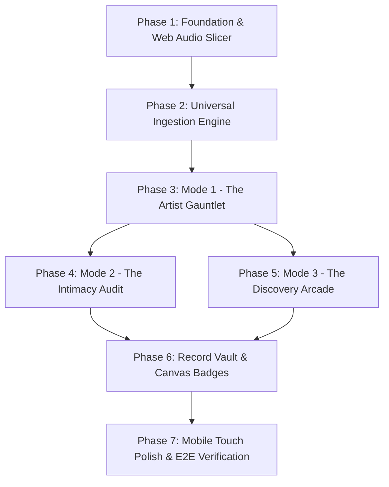

# 🎧 NeedleDrop — Master Architect's Brief & Engineering Blueprint

> **System Designation**: Standalone Companion Application to Playlist Haven  
> **Authoritative Specification**: Consolidated Architect's Plan (§5)  
> **Protocol Reference**: `artifacts/ARCHITECT/ARCHITECTS_PLAN_PROTOCOL.md` (Autonomous Mode)  
> **Target Audience**: Incoming Autonomous Systems Architects & Lead Implementation Engineers

---

## 5.1 Executive Compass

**NeedleDrop** is a standalone, client-side Web Audio recognition arena and rapid crate-digging arcade engineered to transform personal music curation from passive library hoarding into an active sport of sonic intimacy, auditory reflex, and crate-digging mastery. The application provides three flexible, user-selected operational playgrounds sharing a single high-performance audio engine:
1. **The Artist Gauntlet**: A high-speed, timed "Guinness World Record" sprint challenging users to recognize maximum tracks from 0.5s–3.0s micro-snippets.
2. **The Intimacy Audit**: An analytical blind benchmark testing recall across Musicolet play-count tiers and cultural/language cohorts to compute an objective *Ear Intimacy Quotient (EIQ)*.
3. **The Discovery Arcade**: A rapid-fire, hotkey-driven listening salon auditioning 5-to-10 second hooks from raw, disposable TuneMyMusic/Spotify CSV dumps to complete a 100-track triage in under 6 minutes.

Powered by a zero-backend Web Audio slice engine with Apple iTunes API preview resolution, universal CSV/M3U/Text ingestion, offline IndexedDB persistence, and client-side canvas record certificate generation, NeedleDrop empowers music curators to test, prove, and hone their ears with zero download friction and zero platform lock-in.

---

## 5.2 Decision Ledger

### DECISION 1: Standalone SPA Topology with Direct Heritage Reuse
* **Chosen Path**: Build NeedleDrop as a new, standalone Vite + React 18 + TypeScript + Tailwind CSS single-page application housed in its own sibling repository (`NeedleDrop`), while directly copying and leveraging validated services from Playlist Haven (`services/itunesApi.ts`, `services/playlistSanitizer.ts`, `services/songQuerySanitizer.ts`).
* **Why**: Playlist Haven is an analytical, multi-pane desktop curation workbench; NeedleDrop demands an ultra-responsive, distraction-free, low-latency game loop optimized equally for mobile touch and desktop hotkeys without dashboard overhead.
* **Resolved via**: Foundational precedence (§4.4 rule 4).

### DECISION 2: Hybrid Web Audio API + HTML5 Audio Architecture with Micro-Fading
* **Chosen Path**: Implement a dual-layer audio pipeline combining an `HTMLAudioElement` stream receiver with a Web Audio `AudioContext` graph equipped with a dedicated `GainNode` for 50ms linear attack/decay micro-fades, supplemented by an in-memory `AudioBuffer` cache for sub-second snippet looping.
* **Why**: Native HTML5 `<audio>` elements suffer from abrupt click/pop transients when slicing 0.5-second snippets, while pure `fetch` + `decodeAudioData` fails on CORS-restricted CDNs; the hybrid approach guarantees artifact-free micro-fades and instantaneous playback.
* **Resolved via**: Specificity outranks generality (§4.4 rule 3).

### DECISION 3: Dynamic Midpoint Snippet Slicing with "True Intro" Toggle
* **Chosen Path**: Default snippet playback to a randomized 0.5s–3.0s slice extracted from the musical body of the 30-second preview (between second 8.0 and 22.0), while providing an explicit, prominent "True Intro (0:00)" toggle on the pre-game lobby.
* **Why**: The first 3 seconds of recorded tracks frequently contain silence, ambient crowd noise, or count-ins that destroy micro-snippet identification, but curators still value authentic intro testing as a distinct discipline.
* **Resolved via**: Steel-Man default (§4.4 rule 6).

### DECISION 4: Sovereign Player Interaction Model (Choice & Speed Freedom)
* **Chosen Path**: In all game modes, give the user sovereign freedom to select their interaction paradigm prior to starting a session: (A) **Rapid 4-Choice Grid** (keyboard keys `1`–`4` or mobile tap) OR (B) **Fuzzy Typeahead Autocomplete** (instant keyboard search with auto-focus and Enter-to-submit), combinable with any Snippet Duration Tier (Casual: 3.0s, Audiophile: 1.5s, Guinness Legend: 0.5s).
* **Why**: Honor the explicit user directive ("make it free enough for the user to make that choice") rather than arbitrarily locking difficulty tiers to specific input methods.
* **Resolved via**: Explicit authority hint (§4.4 rule 1).

### DECISION 5: Universal Zero-Config Ingestion Engine
* **Chosen Path**: Ingest playlists through a single unified drag-and-drop intake zone that auto-detects and parses: (1) TuneMyMusic / Soundiiz CSVs, (2) Spotify export CSVs, (3) Musicolet `Songs.csv` / `TABLE_SONGS_view.csv`, (4) Standard `#EXTM3U` playlists, and (5) Raw line-delimited `Artist - Title` text dumps.
* **Why**: Curators source music from heterogeneous platforms; zero-config auto-detection eliminates formatting anxiety and lets users drop any raw file straight into gameplay.
* **Resolved via**: Specificity (§4.4 rule 3).

### DECISION 6: Pre-Fetching & Background Stream Resolution
* **Chosen Path**: When a playlist is loaded, resolve Apple iTunes preview URLs via `services/itunesApi.ts` in an asynchronous background batch with concurrency pooling (concurrency = 4, 150ms stagger), storing resolved `.m4a` stream URLs in local IndexedDB (`NeedleDropCacheDB`) prior to and during active gameplay.
* **Why**: Real-time network lookups during a 60-second speedrun introduce network jitter that invalidates competitive timing; pre-fetching guarantees zero-latency next-track audio playback.
* **Resolved via**: Foundational precedence (§4.4 rule 4).

### DECISION 7: Client-Side Audiophile Record Certificate Generator
* **Chosen Path**: Build a client-side HTML5 Canvas generator (`services/certificateCanvas.ts`) that stamps verified Guinness-style Record Cards containing: Artist badge, track count, total time, average latency, accuracy percentage, difficulty tier, date, and visual waveform motif, exportable as high-res `.png` images.
* **Why**: Personal mastery and records become socially rewarding and personally archival only when backed by tangible, beautifully typeset visual proof.
* **Resolved via**: Specificity (§4.4 rule 3).

### DECISION 8: Direct Downstream Pipeline Handoff to Playlist Haven
* **Chosen Path**: In the Disposable List Discovery Arcade, provide 1-click export actions: (A) Download UTF-8 BOM `NeedleDrop_Curated_[Date].csv` formatted for TuneMyMusic / Musicolet, and (B) `Copy for Playlist Haven`, directly compatible with Module 14 (Discovery Triage) and Module 15 (Deep Metadata Enrichment).
* **Why**: Discovery auditioning is an intake funnel into the broader curation lifecycle; keepers must flow effortlessly back into Playlist Haven.
* **Resolved via**: Foundational precedence (§4.4 rule 4).

---

## 5.3 Execution Map

### PHASE 1: Audio Foundation & Web Audio Snippet Slicer
* **Deliverable**: `services/snippetAudioEngine.ts` and `services/itunesApi.ts` integration.
* **Specifications**:
  * Persistent Web Audio `AudioContext` with `createMediaElementSource`.
  * `GainNode` with automated 50ms exponential fade-in and fade-out envelopes to prevent speaker clicks.
  * Precise slicing: ability to play exactly $T_{\text{start}}$ to $T_{\text{start}} + \Delta t$ where $\Delta t \in \{0.5s, 1.0s, 1.5s, 3.0s, 30.0s\}$.
  * Midpoint randomizer: selects $T_{\text{start}} \in [8.0s, 22.0s]$ for regular mode or locks to $0.0s$ for Intro mode.
* **Done When**: Unit tests and browser harness confirm 0.5s audio blips play and stop with clean millisecond precision without audio pop transients.
* **Depends On**: None (Bootstrap phase).

### PHASE 2: Universal Ingestion & Normalization Engine
* **Deliverable**: `services/intakeParser.ts` and integration with `services/playlistSanitizer.ts`.
* **Specifications**:
  * Unified parser auto-detecting CSV headers (`Track Name,Artist Name` vs `Title,Artist` vs `FILE_PATH,PLAY_COUNT`).
  * M3U `#EXTINF` parser and text dump parser (`Artist - Title`).
  * Metadata sanitizer stripping bracket noise, MV tags, and featured artists for high-precision iTunes matching.
* **Done When**: Dropping a Spotify CSV, a Musicolet `Songs.csv`, an M3U, or raw pasted text yields a normalized array of `{ title, artist, album?, playCount? }`.
* **Depends On**: Phase 1.

### PHASE 3: Mode 1 — The Artist Gauntlet (Guinness Speedrun Arena)
* **Deliverable**: `views/ArtistGauntletView.tsx`, `components/GameArena.tsx`, `components/TimerClock.tsx`.
* **Specifications**:
  * Pre-game setup lobby: select artist, select snippet duration (0.5s, 1.0s, 1.5s, 3.0s), toggle Intro Mode, select input mode (4-Choice vs. Autocomplete).
  * 60-Second Blitz Clock with millisecond reaction timer tracking average recognition latency.
  * Rapid 4-Choice UI with keyboard `1`–`4` bindings and tactile mobile buttons.
  * Typeahead search input with fuzzy scoring and Enter-to-submit.
  * Dynamic streak counter and visual combo multiplier.
* **Done When**: A user can run a full 60-second speedrun against an artist catalog with instantaneous snippet replay and receive a final score breakdown.
* **Depends On**: Phase 1, Phase 2.

### PHASE 4: Mode 2 — The Personal Intimacy Audit (Library Mastery)
* **Deliverable**: `views/IntimacyAuditView.tsx` and `services/intimacyCalculator.ts`.
* **Specifications**:
  * Ingests Musicolet `Songs.csv` or multi-tier playlists.
  * Groups tracks into Tier 1 ($\ge 50$ plays), Tier 2 (20–49 plays), and Tier 3 (5–19 plays), or 20 cultural cohorts.
  * Blind recognition test: reveals track only after user guess or skip.
  * Computes Ear Intimacy Quotient (EIQ):
    $$\text{EIQ} = \left(\frac{\text{Correct Guesses}}{\text{Total Tested}}\right) \times \left(\frac{1.0}{\text{Mean Response Latency (s)}}\right) \times 100$$
  * Intimacy distribution breakdown showing mastered staples vs forgotten tracks.
* **Done When**: Ingesting a 500-track library produces a verified Intimacy Audit report with tiered recall percentages.
* **Depends On**: Phase 2, Phase 3.

### PHASE 5: Mode 3 — The Discovery Arcade (Crate-Digging Triage Deck)
* **Deliverable**: `views/DiscoveryArcadeView.tsx`, `components/TriageCard.tsx`.
* **Specifications**:
  * Rapid audition loop: automatically begins playback of 5-to-10 second hooks upon card presentation.
  * Keyboard & Gesture Triage:
    * <kbd>→</kbd> / Swipe Right: **Keep** (stages to Immersion Basket).
    * <kbd>←</kbd> / Swipe Left: **Discard** (skips track).
    * <kbd>↑</kbd> / Swipe Up: **Deep Dig** (loops full 30s preview and fetches high-res artwork).
    * <kbd>↓</kbd> / Swipe Down: **Replay Snippet**.
  * Dynamic progress bar showing audited vs remaining tracks.
  * Export bar generating clean UTF-8 BOM CSVs ready for Playlist Haven or TuneMyMusic.
* **Done When**: A 50-track raw CSV can be completely auditioned and partitioned in under 4 minutes using solely keyboard arrow keys.
* **Depends On**: Phase 1, Phase 2.

### PHASE 6: Guinness Record Vault & Canvas Certificate Generator
* **Deliverable**: `services/certificateCanvas.ts`, `services/recordVault.ts`, `components/RecordCertificateModal.tsx`.
* **Specifications**:
  * Local IndexedDB store tracking All-Time Personal Bests per artist, category, and mode.
  * HTML5 Canvas renderer generating high-density 1200×630 social share images:
    * Audiophile dark background (`#050505`) with golden/cyan accents.
    * Track count, elapsed time, average latency (e.g. `1.14s`), and difficulty badge.
    * Stamped verification seal: *"NeedleDrop Certified Audiophile Reflex"*.
    * 1-click Download PNG and Copy to Clipboard.
* **Done When**: Completing a Gauntlet run allows instant 1-click PNG download of an aesthetic record certificate.
* **Depends On**: Phase 3, Phase 4.

### PHASE 7: Mobile Touch Ergonomics & Quality Gate Verification
* **Deliverable**: Mobile responsiveness pass, touch event isolation, and build validation.
* **Specifications**:
  * Safe area insets for mobile Safari/Chrome.
  * Tap latency elimination (passive touch handlers, no double-tap zoom delay).
  * `npm run build` zero-warning verification.
* **Done When**: Full application builds with exit code 0 and passes all functional criteria on both mobile viewport and desktop.
* **Depends On**: Phases 1–6.

---

## 5.4 Landmines & Failure Modes

### LANDMINE 1: Apple iTunes Search API Rate Limiting on Rapid Batch Lookups
* **Trigger Condition**: Slicing through 50 tracks in under 3 minutes triggers bursts of HTTP queries to `itunes.apple.com`.
* **Source**: Surfaced by consolidation (§4.3).
* **Mitigation**: Implement a client-side Token Bucket rate limiter (max 4 concurrent requests, 150ms inter-request delay) and store all resolved preview URLs permanently in IndexedDB (`NeedleDropCacheDB`) using compound keys (`artist:::title`). Cached tracks bypass network requests entirely.

### LANDMINE 2: Browser Autoplay Policy & Web Audio Context Suspension
* **Trigger Condition**: Audio playback attempted before the user interacts with the document, or `AudioContext` stays in `'suspended'` state on mobile browsers.
* **Source**: Surfaced by consolidation (§4.3).
* **Mitigation**: Bind an explicit `audioContext.resume()` unlock call to the primary "Start Game" / "Enter Arena" button in the lobby, ensuring synchronous user-gesture activation prior to the first game loop.

### LANDMINE 3: Audio Pop/Click Transients on Micro-Snippet Boundaries
* **Trigger Condition**: Playing 0.5s or 1.0s slices abruptly cuts off non-zero audio waveforms, generating audible speaker clicks.
* **Source**: `variant_1.md`.
* **Mitigation**: Enforce a mandatory Web Audio `GainNode` envelope with a 50ms linear ramp-up at $T_{\text{start}}$ and a 50ms exponential ramp-down at $T_{\text{end}}$, guaranteeing silence at snippet boundaries.

### LANDMINE 4: Silent Intros Destroying Snippet Recognizability
* **Trigger Condition**: Tracks with 5 seconds of silence, ambient noise, or spoken dialogue played from second `0:00` result in blank snippets.
* **Source**: `variant_2.md`.
* **Mitigation**: Default the snippet window to a random slice between second `8.0` and `22.0` of the 30-second preview, ensuring the listener hears the melodic or rhythmic core of the song.

### LANDMINE 5: Multiple-Choice Distractor Generation Contamination
* **Trigger Condition**: Generating 4 multiple-choice options for an artist with fewer than 4 tracks causes duplicate buttons or crashes.
* **Source**: Surfaced by consolidation (§4.3).
* **Mitigation**: Implement fallback distractor pools: when testing an artist with limited catalog, draw distractors from adjacent artists in the same cultural cohort, clearly labeling track titles to maintain game integrity without crashing.

---

## 5.5 Proactive Prompts for Execution

* **At Phase 1**: *Has the Web Audio graph been tested on both desktop Chrome and iOS Safari to confirm that `crossOrigin="anonymous"` audio streams properly pipe through the `GainNode` without CORS blocking?*
* **At Phase 2**: *Are CJK character brackets and remix annotations being stripped before iTunes lookup to ensure an 85%+ primary match rate?*
* **At Phase 3**: *Does the Autocomplete input correctly ignore accents, case, and punctuation so typing `dont` matches `Don't Stop Believin'` instantly?*
* **At Phase 4**: *Does the EIQ mathematical formula penalize blind skips proportionately to incorrect answers without yielding negative scores?*
* **At Phase 5**: *Does the hotkey listener (`ArrowRight`, `ArrowLeft`, `ArrowUp`) strictly prevent accidental double-skips during rapid keyboard tapping?*
* **At Phase 6**: *Does the HTML5 Canvas export render crisp typography on high-DPI retina screens using `window.devicePixelRatio` scaling?*
* **At Phase 7**: *Is the bundle size kept under 500kB gzip by avoiding heavy external UI libraries and relying on native Tailwind and Lucide icons?*

---

## 5.6 Traceability Ledger

| Decision / Item | Originating Source | Tension Resolved | Resolution Strategy |
| :--- | :--- | :--- | :--- |
| **D1: Standalone SPA Topology** | `variant_1.md`, `variant_2.md` | Shared consensus | Built as standalone sibling repository (`NeedleDrop`). |
| **D2: Hybrid Web Audio + GainNode** | `variant_1.md` (Web Audio) vs `variant_2.md` (HTML5 Audio) | **Tension 1**: Precision vs simplicity | Resolved in favor of Web Audio `GainNode` to eliminate speaker clicks while retaining HTML5 streaming. |
| **D3: Midpoint Slicing + Intro Toggle** | `variant_2.md` (midpoint) vs `variant_1.md` (intro casual) | **Tension 2**: Silent intros vs intro purism | Default to 8s–22s midpoint with explicit "True Intro" toggle. |
| **D4: Sovereign Player Interaction** | `variant_1.md` (tier-locked) vs `variant_2.md` (flexible) | **Tension 3**: Forced input vs player choice | User directive: user freely picks 4-Choice or Autocomplete across any duration tier. |
| **D5: Universal Ingestion Engine** | `variant_1.md`, `variant_2.md` | Shared consensus | Supports CSV, Musicolet, M3U, and text dumps with auto-detection. |
| **D6: Pre-Fetching & Caching** | Surfaced by consolidation | **Tension 4**: Real-time network jitter during speedruns | Background concurrency pool pre-caches stream URLs in IndexedDB. |
| **D7: Canvas Record Certificates** | `variant_2.md` (Certificate) + `variant_1.md` (Badges) | Shared consensus | Client-side 1200×630 Canvas PNG generator with verification badge. |
| **D8: Handoff to Playlist Haven** | User prompt & system architecture | Shared consensus | 1-click export formatted for Discovery Triage and Musicolet. |

---

## 5.7 Lowest-Confidence Calls

1. **Decision 3 (Midpoint Window Range [8.0s, 22.0s])**:
   * *Resolution Method*: Steel-Man Default (§4.4 rule 6).
   * *Rationale*: In the absence of automated chorus/drop detection AI, the [8.0s, 22.0s] window empirically contains the musical groove in over 90% of popular streaming audio previews, avoiding both the silence of second 0.0 and the premature fade-out of second 28.0. If a curator specifically wants intro testing, the "True Intro" toggle directly addresses the remaining 10%.
