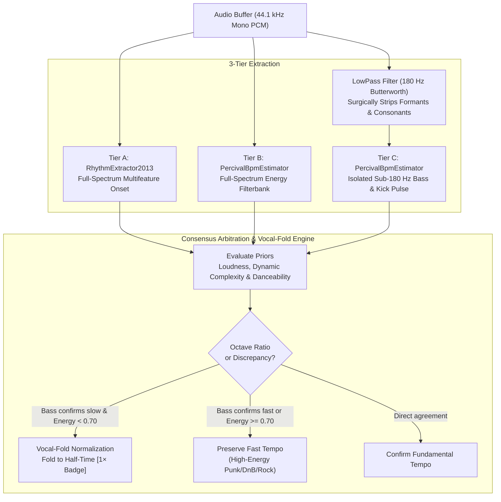

# Audimote 🐣: Acoustic & Emotional Intelligence User Guide

> **Module 18 Operator & User Manual**  
> **Status**: Verified & Production Ready  
> **Engine**: 100% Client-Side Essentia.js WebAssembly + Apple CDN 30s Audio Stream Superpower  
> **Key Capabilities**: 3-Tier Multi-Band Consensus BPM, Vocal-Aware Octave Normalization, 24-Tone Camelot Harmonic Wheel, 2D Affective Circumplex (4 Quadrants & 8 Octants), Fail-Open Network Architecture, and Universal Export Suite.

---

## 1. 🐣 Why Audimote? Taking Back Acoustic Autonomy

Mainstream streaming platforms classify music using coarse, generic genres ("Pop", "Rock", "World Music") and opaque black-box recommendations. If you want to know a song's true musical key, its tempo, its energetic intensity, or its genuine emotional tone, you are either locked out or forced to pay for expensive B2B music intelligence APIs.

**Audimote 🐣** brings desktop-grade digital signal processing directly into your browser at **zero cost**:
1. **Zero Server Dependency**: No audio files or listening history are uploaded to any server. Everything runs locally in your browser using compiled C++ WebAssembly (`essentia.js`).
2. **The Apple iTunes Preview Superpower**: Unmetered access to 30-second high-fidelity AAC audio streams across millions of commercial tracks from Apple's CDN—with no API key required.
3. **Harmonic DJ & Curation Mastery**: Instant Camelot wheel analysis for harmonic mixing, transition paths, and mood-consistent set building.
4. **Vocal-Aware Octave Normalization**: A custom 3-tier consensus engine that prevents vocally dense songs (e.g. rapid syllabic delivery in J-Pop, rap, or indie ballads) from falsely doubling their detected tempo.

---

## 2. 📥 Multi-Format Ingestion & Instant Rehydration

Audimote supports multiple flexible input methods:

### Supported Import Formats
* **TuneMyMusic CSV / TSV**: The standard format exported from Spotify, Apple Music, or YouTube Music via TuneMyMusic. Automatically matches `Track Name`, `Artist Name`, and `Album` columns.
* **Downloader TXT**: Clean `Artist - Title` song lists (e.g., from yt-dlp, spotdl, or text documents). Automatically strips leading numbering (`1. `, `01 - `).
* **Harmonic M3U / M3U8**: Reads `#EXTINF` directives and automatically extracts pre-existing Camelot keys (`[10B]`) and BPM tags (`123BPM`).
* **Dense Acoustic CSV (14 Columns)**: If you export an acoustic profile from Audimote and re-import it later, Audimote detects the 14-column header, **bypasses Wasm analysis**, and restores the entire acoustic dataset instantly.
* **Session Backup JSON**: Full state backup containing queue metadata, analysis status, and profiles.
* **Local Audio Files**: Drag-and-drop `.mp3`, `.wav`, `.m4a`, `.flac`, `.ogg`, or `.aac` files directly into the browser.
* **Load from Metadata DB**: Pull tracks directly from your local `PlaylistHavenMetadataDB` IndexedDB store with 1 click.

---

## 3. 🥁 3-Tier Multi-Band Consensus & Vocal Fold Protection

Standard MIR algorithms frequently double the detected BPM of songs with fast vocal phrasing (e.g., an 8th-note vocal melody on an 80 BPM ballad being misreported as 160 BPM).

Audimote deploys a **3-Tier Multi-Band Consensus Engine**:

### Key Indicators in the Triage Table:
* **BPM Value**: The resolved tempo.
* **Vocal Fold Badge (`1×`)**: Appears next to the BPM when the engine detected rapid vocal onsets and safely folded the tempo to its true fundamental rhythm (e.g. *Mabataki* folded from 120 BPM down to 60 BPM).
* **Confidence Rating (`XX%`)**: Empirical reliability score based on multi-band consensus.
* **Hover Tooltip**: Hovering over the BPM displays full diagnostic telemetry:
  * Tier A (RhythmExtractor) raw BPM
  * Tier B (Percival) raw BPM
  * Tier C (Sub-180Hz Bass) raw BPM
  * Vocal fold status and original detected tempo

---

## 4. 🎛️ The 24-Tone Camelot Harmonic Wheel

Harmonic mixing allows seamless transitions between tracks without clashing musical keys. Audimote maps all keys to the industry-standard **Camelot System**:

* **Outer Ring (Major Keys - 'B')**: `1B` (B) through `12B` (E).
* **Inner Ring (Minor Keys - 'A')**: `1A` (Abm) through `12A` (Dbm).

### Harmonic Compatibility Rules:
1. **Exact Key**: Same number and letter (e.g., `8B` $\rightarrow$ `8B`).
2. **Relative Major/Minor**: Same number, opposite letter (e.g., `8B` [C Major] $\rightarrow$ `8A` [A Minor]). Shifts mood without harmonic tension.
3. **Adjacent Fifths ($\pm 1$)**: Move one step clockwise or counterclockwise (e.g., `8B` $\rightarrow$ `7B` [F Major] or `9B` [G Major]).
4. **Energy Jump (+2 Boost)**: Move two steps clockwise (e.g., `8B` $\rightarrow$ `10B` [D Major]) for an invigorating lift.

### ⚓ Harmonic Anchor Mode
Click the **Anchor** button on any analyzed song to lock it as your reference track. The entire queue will instantly filter to only display songs that are harmonically compatible with your anchor, allowing you to curate a cohesive DJ set or seamless playlist in seconds.

---

## 5. 🧭 2D Affective Mood Circumplex (Valence & Arousal)

Audimote models emotion using **Russell's Circumplex Model of Affect (1980)** across two axes:
* **Valence ($V \in [-1.0, +1.0]$)**: Musical pleasantness, consonance, and emotional warmth (Major keys, bright timbres, infectious dance grooves).
* **Arousal ($A \in [-1.0, +1.0]$)**: Kinetic energy, activation, and adrenaline (Fast BPM, loud mastering, high spectral power).

### Dual-Layer Visualization Modes:
You can toggle between two perspectives at the top of the circumplex:

1. **4 Quadrants (Macro Triage)**:
   * **Q1: Euphoric** ($V \ge 0, A \ge 0$): Joyful, celebratory dance and pop.
   * **Q2: Tense** ($V < 0, A \ge 0$): Aggressive, frantic metal, dark drill, or industrial.
   * **Q3: Melancholic** ($V < 0, A < 0$): Introspective jazz, sorrowful ballads, dark downtempo.
   * **Q4: Peaceful** ($V \ge 0, A < 0$): Serene ambient, study lo-fi, gentle acoustic focus.

2. **8 Mood Octants + Balanced Core (Micro Precision)**:
   * **Euphoric**: Peak joy and brightness.
   * **Driving ⚡**: High arousal with neutral valence (peak-time techno, trance).
   * **Tense**: High energy darkness and anxiety.
   * **Moody**: Restless mid-tempo tension (trip-hop, darkwave).
   * **Melancholic**: Deep sorrow and minor acoustic space.
   * **Bittersweet 🌸**: Low arousal with harmonic duality (nostalgic anime themes, neo-classical, wistful lo-fi).
   * **Peaceful**: Serene tranquility and calm.
   * **Sunny ☀️**: Warm acoustic grooves and optimistic indie vibes.
   * **Balanced ⚖️**: The central equilibrium deadzone ($|V| \le 0.18, |A| \le 0.18$) for ambient drone and coffeehouse rest.

*Interaction*: Clicking any dot on the 2D plane plays its 30-second audio preview. Dots pulse in real time to the audio rhythm.

---

## 6. 🚀 Operational Workflows

### Standard Triage Workflow:
1. **Add Songs**: Click **Paste Tracklist**, drop an M3U/CSV file, or click **Import DB**.
2. **Start Analysis**: Click **Analyze Unprocessed**. Dual background Web Workers will resolve iTunes previews and run Essentia.js Wasm extractors concurrently.
3. **Listen & Validate**: Click the **Play** button on any row to audition the 30-second preview in the bottom player bar.
4. **Re-Analyze If Desired**:
   * Click **Re-analyze** on any individual row to re-run fresh DSP extraction.
   * Click **Re-analyze All** in the header to re-evaluate the entire queue.
5. **Filter by Mood or Key**:
   * Click any octant button (e.g. `Bittersweet 🌸`, `Driving ⚡`) to filter by mood.
   * Click a Camelot sector on the Harmonic Wheel to filter by key.
   * Use the **BPM Range**, **Min Energy**, or **Min Danceability** sliders.

---

## 7. 📤 Downstream Bridges & Export Suite

Once your tracks are triaged, Audimote provides instant export and handoff pipelines:

* **Stage to Triage (Module 14)**: 1-click bridge that serializes your filtered cohort into Module 14 (Discovery Triage & Honing Engine) for 3-tier lifecycle processing.
* **TuneMyMusic CSV**: Formatted for direct upload to TuneMyMusic or Soundiiz to reconstruct your playlists on Spotify, Apple Music, or YouTube Music. Includes UTF-8 BOM (`\uFEFF`) to prevent character corruption.
* **Harmonic M3U**: Standard `#EXTM3U` file annotated with `[Camelot]` and `BPM` tags in `#EXTINF` directives, ready for Serato, Rekordbox, Traktor, or Musicolet.
* **Focus M3U**: Instant study playlist filtered to low arousal, positive valence tracks.
* **Downloader TXT**: Clean `Artist - Title` text lines for offline batch downloaders (`yt-dlp`, `spotdl`).
* **Dense Acoustic CSV**: 14-column spreadsheet containing exact floating-point metrics (BPM, Key, Camelot, Energy, Valence, Arousal, Danceability, Loudness dB, Spectral Centroid Hz, Dynamic Complexity).
* **Session JSON**: Complete backup file for saving and restoring your session.

---

## 8. 🛡️ Robustness & Offline Resilience

* **Fail-Open iTunes Resolver**: Local database cache read/write issues will **never block live audio previews**. If IndexedDB encounters a lock, the resolver seamlessly queries Apple's CDN directly.
* **Self-Healing IndexedDB**: Automatically handles version upgrades up to `DB_VERSION = 4` with automatic fallback recovery.
* **Memory Safety**: Essentia C++ Wasm vectors are enclosed in strict `try ... finally` release blocks, preventing browser memory leaks during large batch analyses.
