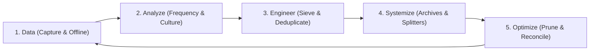
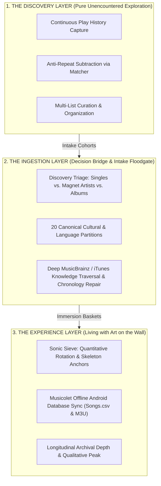

# 🎧 Playlist Haven — Comprehensive System & Architecture Brief

> *"To have your art on the wall is to experience it. To find your art is to use the discovery engine; to stop there is to put it in the attic. To use the experience engine is to put your art on your wall and live with it."*

---

## 1. 💡 Philosophy & Architectural Narrative

### 1.1 The Creed: Discovery Engine vs. Experience Engine
* **The Problem**: Mainstream streaming services (Spotify, Apple Music, YouTube Music) are engineered as **Discovery Engines**. Their business models optimize for capitalistic novelty, algorithmic feed fatigue, and disposable short-play metrics (treating songs as 30-second commodity hooks). They lock listening histories behind walled gardens, obscure objective play metrics, or ration them once a year as marketing campaigns (e.g. Spotify Wrapped).
* **The Solution**: **Playlist Haven is the Experience Engine Made Real**. It is an offline-first, client-side, desktop-grade audio workbench built to empower music audiophiles and curators to actively shape, prune, sieve, cluster, and live with their personal music libraries over decades.

### 1.2 Cultural & Language Roots over Generic Western Genres
Broad commercial labels like "World Music" or generic "Pop" erase the cultural and linguistic nuance of global art. Playlist Haven rejects arbitrary genre buckets in favor of authentic **spoken language and artist nationality** partitioned across **20 canonical cultural buckets**:
* `English`, `J-Pop`, `Naija`, `K-Pop`, `C-Pop`, `Thai`, `Vietnamese`, `Dutch`, `Arabic`, `German`, `Italian`, `Portuguese / Brazilian`, `Filipino`, `I-Pop`, `African`, `Latina`, `Français`, `Gospel`, `Instrumental`, and `Other`.

### 1.3 The DAESO Curation Cycle
All curation workflows inside Playlist Haven follow a 5-step continuous loop:
$$\text{Data} \longrightarrow \text{Analyze} \longrightarrow \text{Engineer} \longrightarrow \text{Systemize} \longrightarrow \text{Optimize} \longrightarrow \text{Data}$$



1. **Data (Capture & Storage)**: Raw play-history CSVs, YouTube text dumps, screenshot digitizations, MusicBrainz Web Service v2 & Apple iTunes cataloging, and local IndexedDB database stores.
2. **Analyze**: Frequency counters, missing-track reconciliations, 20-bucket language clustering, and AI precision query diagnosis.
3. **Engineer**: Dynamic play-count sieving, skeleton anchors, smart randomizers, metadata normalization, and disambiguation candidate linking.
4. **Systemize**: Chronological week/month/year archives, multi-part sub-playlist splitters, tagged M3U8 exports, and 38-column CSV master schemas.
5. **Optimize**: Fuzzy Jaro-Winkler cross-pruning, duplicate removal, penalty play lists, and offline physical drive reconciliation.

### 1.4 The 3-Tier Musical Lifecycle Architecture
> *"With 10,000+ hours I thought I had seen it all, but I am truly in new terrains encountering new problems at never imagined scales. The ultimate music experience is an asymptote; you can love and resonate with an endless number of songs and artists. Only the right tools and organization levels will set you straight."*

Rather than treating curation as a flat list, Playlist Haven conceptualizes the musical journey as an evolutionary progression across three distinct architectural layers, where each layer executes its own internal DAESO cycle:

$$\text{Layer 1: Discovery (Pure Exploration)} \xrightarrow{\text{Intake Cohorts}} \text{Layer 2: Ingestion (Decision Bridge)} \xrightarrow{\text{Immersion Baskets}} \text{Layer 3: Experience (Living with Art on the Wall)}$$



* **Layer 1: The Discovery Layer (Pure Unencountered Exploration)**
  * **Enabling Data Capture**: Systematic logging of listening activity provides the foundational data that makes the DAESO loop possible.
  * **Anti-Repeat Purity Guard**: To prevent algorithmic recycling, the **Playlist Matcher / Reconciler (Module 8)** and **Manipulator (Module 4)** actively subtract all historically played tracks and existing offline library files from new discovery queues before listening begins.
  * **Total Curatorial Sovereignty (Breaking the '1-Song / 1-Playlist' Cage)**: Powered by the **Playlist Manipulator (Module 4)**—the foundational genesis of Playlist Haven. Delivers desktop-grade multi-pane workspaces (1, 2, or 4 simultaneous viewports), range selection, conditional filtering, mathematical set operations (Union, Intersect, Difference), and seamless `.m3u` $\leftrightarrow$ `.csv` format independence.
* **Layer 2: The Ingestion Layer (The Decision Bridge & Intake Floodgate)**
  * **The Intake Problem**: When total discovery freedom is unlocked, curators inevitably hit the "Intake Wall"—an overwhelming influx of new music causing severe decision paralysis.
  * **The Bridge**: Personified by **Discovery Triage (Module 14)**, **Language Clustering (Module 13)**, **Deep Enrichment (Module 15)**, and **Playlist Resequencer (Module 16)**.
  * **Tri-Philosophy Division**: Partitions raw cohorts into probe singles, magnet artists ($\ge 4$ songs), and validated albums ($\ge 2$ songs) with 1-click batch actions (Promote, Singlesify, Defer), while restoring 20-bucket cultural context and repairing cross-platform conversion chronology.
* **Layer 3: The Experience Layer (Living with Art on the Wall)**
  * **Peak Resonance & Dwelling**: Where songs that survived discovery and ingestion are experienced over months and years.
  * **The Sonic Sieve Heartbeat**: Where the DAESO loop originated. Requires data-capable environments (such as Musicolet or Last.fm scrobble CSV exports) to supply objective play metrics. Employs play thresholds ($\ge 2$), spatial skeleton anchors preserving positional memory, and penalty lists.
  * **Statistical Tier Slicing & Recurrence Audit**: Module 3 partitions libraries into targeted play-count tiers (Tier 1: 50+, Tier 2: 20–49, Tier 3: 5–19); Module 5 audits multi-year recurrence histograms to isolate eternal staples.
  * **Temporal Archiving & Library Hygiene Suite**: Module 6 consolidates weekly rotations into monthly/yearly archives; Module 7 decomposes monolithic 2,000+ song playlists into numbered chapters (`Part 1`, `Part 2`); Module 9 sanitizes noisy tags via regex; Module 4 cross-prunes duplicates.
  * **Offline Audiophile Interlock**: Module 8 bridges streaming tracklists to physical local audio files for native playback in **Musicolet** (Android) with `Songs.csv`, `#EXTINF` metadata, and progressive weekly tier archives.

---

## 2. 🌉 The Walled Garden Streaming Bridge & Musicolet Integration

### 2.1 The Bidirectional Extension Pipeline
Mainstream streaming platforms lack advanced sorting, fuzzy deduplication, multi-tier play-count filtering, or structural manipulation. Playlist Haven extends local desktop-grade power tools to live streaming playlists:

```
   ┌────────────────────────────────────────────────────────┐
   │            [ Walled Streaming Services ]               │
   │            (Spotify, YouTube Music, Apple)             │
   └───────────┬────────────────────────────────┬───────────┘
               │ (Export via third-party tools  ▲ (Import manipulated CSVs
               │  like TuneMyMusic / Soundiiz)  │  back to streaming lists)
               ▼                                │
   ┌────────────────────────────────────────────┴───────────┐
   │                [ Playlist Haven Engine ]               │
   │  Curate, Sieve, Deduplicate, Fuzzy Cross-Prune, Sort   │
   └───────────┬────────────────────────────────────────────┘
               │ (Port final sieved file)
               ▼
   ┌────────────────────────────────────────────────────────┐
   │            [ Autonomous Music Environments ]           │
   │       Musify (Free YT Streaming) / Musicolet (Android) │
   └────────────────────────────────────────────────────────┘
```

1. **Extract**: Export streaming playlists via online synchronization utilities (TuneMyMusic, Soundiiz) or browser text scrapers into CSV/TXT.
2. **Transform**: Import into Playlist Haven. Apply dynamic play-count filters, multi-pane quad view manipulations, fuzzy cross-pruning, language clustering, or discovery triage.
3. **Synchronize**: Export clean **UTF-8 BOM CSVs** and re-import directly back to Spotify or YouTube Music.
4. **Autonomous Transition**: Route sieved CSVs/M3Us into **Musify** or **Musicolet** for 100% offline, algorithm-free playback.

### 2.2 Deep Musicolet Integrations (Celebrating 10 Years of Musicolet)
Musicolet is the gold standard for offline Android music management. Playlist Haven natively interlocks with Musicolet's data formats:
* **Channel A: Songs CSV Exports (Quantitative Core)**: Ingests `Songs.csv` / `TABLE_SONGS_view.csv`, parsing `FILE_PATH` and `PLAY_COUNT` columns with UTF-8 BOM sanitization. Recognizes weekly naming conventions (`Most played Songs • Week X - YYYY.csv`) and appends exact play-tier statistics in parentheses, e.g. `Most played Songs • Week 19 - 2026 (12).csv`.
* **Channel B: M3U Playlist Exports (Qualitative & Structural Core)**: Full `#EXTM3U` and `#EXTINF` metadata extraction. Preserves system-specific Android pathways (e.g. `/storage/emulated/0/Music/...`, `Android/media/...`). Resolves play-count ties using previous M3U playlists as structural "skeleton anchors" to preserve human sequencing memory.
* **Channel C: Plain Text Song Lists**: Line-by-line `[Title] - [Artist]` cataloging using `lastIndexOf(' - ')` parsing to protect hyphens in song titles.

---

## 3. 🎛️ Complete 16-Module Functional Specifications

```mermaid
graph TD
    subgraph Layer 1: Discovery & Acquisition
        M11["11. Vision-to-Playlist AI"]
        M12["12. Scrape Stripper & Formatter"]
        M4["4. Playlist Manipulator Quad-View"]
        M9["9. Smart Renamer & Tag Editor"]
        M10["10. Playlist Randomizer"]
    end

    subgraph Layer 2: Ingestion & Cultural Bridge
        M14["14. Discovery Triage & Honing Engine"]
        M13["13. Language & Nationality Clustering"]
        M15["15. Deep Metadata Enrichment Engine"]
        M16["16. Playlist Resequencer & Chronology Restorer"]
    end

    subgraph Layer 3: Experience, Rotation & Archival
        M1["1. Sonic Sieve Logic Engine"]
        M2["2. Sonic Sieve 2 Dual-Input"]
        M3["3. Tier Filtering Workbench"]
        M5["5. Appearance Counter"]
        M6["6. Playlist Merger Time-Grouping"]
        M7["7. Playlist Splitter Mega-Slices"]
    end

    subgraph Lifecycle Bridge: Anti-Repeat & Drive Sync
        M8["8. Playlist Matcher / Reconciler"]
    end

    Layer 1 -->|"Intake Cohorts"| Layer 2
    Layer 2 -->|"Immersion Baskets"| Layer 3
```

### Module 1: 🎛️ Sonic Sieve Logic Engine (`SonicSieveView.tsx`)
* **Purpose**: Generates weekly rotating listening diets based on objective play counts.
* **Architecture & Features**:
  * Dual input support: Musicolet Songs CSV and standard M3U/M3U8 playlists.
  * Customizable play count threshold ($\ge 2$ plays default).
  * **Skeleton Anchor**: When dozens of tracks share identical play counts, the previous week's playlist acts as an architectural skeleton, locking historical song positions and appending new candidates at the end.
  * **Penalty Lists**: Ingests preceding playlists to deduct play points for recently rotated tracks.
  * Automatic weekly filename incrementation: `Most played Songs • Week 18 - 2026.csv` $\rightarrow$ `Most played Songs • Week 19 - 2026 (12).csv`.

### Module 2: 🧪 Sonic Sieve 2 — Dual Input Engine (`SonicSieveView2.tsx`)
* **Purpose**: Comparative dual-playlist sieving.
* **Architecture & Features**:
  * Compares an active library against a reference baseline.
  * Computes differential capacities and resolves relative play frequencies.

### Module 3: 📊 Tier Filtering Workbench (`TierFilteringView.tsx`)
* **Purpose**: Statistical partitioning of multi-thousand track libraries into distinct play tiers.
* **Architecture & Features**:
  * Ingests Musicolet `Songs.csv` and slices tracks into customizable tiers (Tier 1: 50+ plays, Tier 2: 20–49 plays, Tier 3: 5–19 plays).
  * Interactive distribution charts and instant sub-playlist generation.

### Module 4: 🪟 Playlist Manipulator — Quad Multi-Pane (`PlaylistManipulatorView.tsx`)
* **Purpose**: Desktop-grade multi-list workspace and cross-playlist deduplicator.
* **Architecture & Features**:
  * Supports **Single, Dual, and 4-Pane Quad Views** side-by-side.
  * Drag-and-drop track reordering between panes.
  * **Fuzzy Cross-Pruner**: Detects cross-playlist duplicates using Jaro-Winkler bigram similarity.
  * Mathematical Set Operations: Union ($A \cup B$), Intersection ($A \cap B$), and Difference ($A - B$).
  * **Format Agility & Deep Filtering**: Seamless bidirectional conversion between `.m3u` and `.csv` formats, plus deep multi-condition filtering (by artist, album, title).
  * *Roadmap*: Slated for evolution into a standalone basic manipulation suite aggregating core playlist utilities.

### Module 5: 📈 Track Appearance Frequency Counter (`PlaylistAppearanceView.tsx`)
* **Purpose**: Multi-year longitudinal listening audit.
* **Architecture & Features**:
  * Ingests dozens of historical playlists simultaneously.
  * Calculates exact recurrence counts per track and per artist.
  * Segregates all-time library staples from one-off transient plays.

### Module 6: 🧬 Playlist Merger & Time-Grouping (`PlaylistMergerView.tsx`)
* **Purpose**: Consolidates fragmented playlists into chronological archives.
* **Architecture & Features**:
  * Automated grouping by timeframe: **Weekly $\rightarrow$ Monthly $\rightarrow$ Yearly** archives.
  * Configurable duplicate resolution (Keep First, Keep Highest Quality, Append All).

### Module 7: ✂️ Playlist Splitter & Decomposer (`PlaylistSplitterView.tsx`)
* **Purpose**: Slices monolithic 2,000+ track playlists into digestible chapters.
* **Architecture & Features**:
  * Partitions by track count, duration, or artist chunks.
  * Sequential numbered naming (`Part 1`, `Part 2`, etc.).

### Module 8: 🔍 Playlist Matcher & Local Reconciler (`PlaylistMatcherView.tsx`)
* **Purpose**: Bridges streaming tracklists to physical local hard drive storage and enforces **Anti-Repeat Discovery Purity**.
* **Architecture & Features**:
  * Ingests online tracklists (Spotify/YouTube scrapes) and searches local directories.
  * Fuzzy bigram similarity matching against local `.mp3`/`.flac` files.
  * Generates 100% playable `.m3u` playlists with absolute local file paths.
  * **Anti-Repeat Discovery Guard**: Subtracts historical play logs and existing local library collections from incoming discovery queues, guaranteeing 100% unencountered novelty without algorithmic recirculation.

### Module 9: 🏷️ Smart Renamer & Tag Normalizer (`SmartRenamerView.tsx`)
* **Purpose**: Batch metadata cleaner and regex formatting workbench.
* **Architecture & Features**:
  * Strips noisy video tags (`[Official MV]`, `(1080p)`, `4K`, `Lyrics`).
  * Smart Title Case with musical acronym preservation (`DJ`, `MC`, `OST`, `REMIX`, `MV`).

### Module 10: 🎲 Intelligent Playlist Randomizer (`PlaylistRandomizerView.tsx`)
* **Purpose**: Cryptographic shuffling with anti-clustering constraints.
* **Architecture & Features**:
  * Enforces **Artist Separation Spacing** (avoids playing the same artist back-to-back).
  * Custom reproducible seeds.

### Module 11: 👁️ Vision-to-Playlist AI Digitizer (`VisionToPlaylistView.tsx`)
* **Purpose**: Rescues trapped playlists from screenshots (offline music player libraries, social media shares, DJ flyers) and creates clean CSV/M3U files ready for local playback or streaming migration via **TuneMyMusic** / **Soundiiz**.
* **Architecture & Features**:
  * Cloud: **Gemini 2.5 Flash** (Primary) with automatic **Gemini 2.0 Flash** failover.
  * Local-First: 100% offline local vision models via OpenAI-compatible endpoints (Ollama / LM Studio with `llama3.2-vision`).
  * Deduplicates OCR results and exports clean `.m3u` / `.csv` formatted for direct TuneMyMusic upload or offline player queues.
  * **Consensus Aggregator (Integrated Mode)**: Ingests multiple community 'Best Of' playlists or screenshots for an artist, cross-tabulating song recurrence to identify true consensus hits. Slated for future decoupling into a dedicated standalone module.

### Module 12: 🪄 Scrape Stripper & Formatter (`ScrapeStripperView.tsx`)
* **Purpose**: Formats messy raw text dumps from YouTube channel video tabs and web scrapers.
* **Architecture & Features**:
  * Strips sidebar recommendations and platform fluff.
  * Handles CJK character orientations and featured artist splitting (`feat.` $\rightarrow$ Artist column).
  * 1-Click **Swap Artist ↔ Title** toggle.

### Module 13: 🌐 Language & Nationality Clustering Engine (`LanguageClusteringView.tsx`)
* **Purpose**: High-speed partitioning of massive libraries into 20 authentic cultural and linguistic cohorts.
* **5-Tier Waterfall Architecture**:
  1. **Tier 0 (Pre-Seeded Cache)**: 1,353+ pre-seeded artist mappings loaded in `<100ms` offline with composite multi-artist splitting (`Wizkid, Skepta`).
  2. **Tier 1 (Unicode Script Histogram)**: Deterministic regex detecting Han/CJK, Kana, Hangul, Devanagari, Thai, and Arabic scripts.
  3. **Tier 2 (MusicBrainz Web Service v2)**: Throttled ISO country-of-origin resolution across 16+ countries with modular area dictionary (`services/areaDictionary.ts`). Features **Strict Null Cascade** (unmapped yields `null`, preventing premature `'Other'` cache poisoning).
  4. **Tier 3 (Context-Enriched Gemini 2.5 Flash Batch AI)**: Batched AI fallback passing raw MusicBrainz hints (area, disambiguation, tags) to resolve cultural nuance with automatic model cascading (`gemini-2.5-flash` $\rightarrow$ `gemini-2.0-flash` $\rightarrow$ `gemini-1.5-flash`) and `⚡ Skip to AI` accelerator.
  5. **Tier 4 (Manual Overrides & Operable Cache Studio)**: Full CRUD studio with inline editing, batch reassignment, JSON backup, and strict persistence hygiene (unresolved entries are barred from `localStorage`).
* **Centralized Sanitizer Integration**: Direct integration with `playlistSanitizer.ts` extracting clean artist/title pairs from composite YouTube strings at an 89%+ extraction rate.
* **Bidirectional Interoperability Bridge**: Ingests directly from Module 15 IndexedDB in 1 click; propagates curated cohorts downstream into Module 14 (Discovery Triage).

### Module 14: 🧭 Discovery Triage & Honing Engine (`DiscoveryTriageView.tsx`)
* **Purpose**: The architectural bridge between ephemeral streaming discovery and deep, multi-month offline immersion.
* **Tri-Philosophy Framework**:
  * **Language & Cultural Bucket Intake View**: Groups cohorts into the 20 canonical cultural buckets to guarantee a balanced global audio diet.
  * **Singles (The Probe)**: Isolates lone sparks and one-off discoveries. Features direct **In-App Decision Audio Previews** (30s `.m4a` streams) across table rows and card grids for zero-tab listening evaluation before staging.
  * **Artists (The Resonance & High-Agency Decision Hub)**: Clusters tracks into **Magnet Artists ($\ge 4$ tracks)** and **Emerging Sparks (2–3 tracks)**, backed by a conflict-resolution suite and in-app audio preview triggers on individual tracks and cluster headers:
    * **Promote to Album / Compilation**: Real-time export of `Album_Intake_[Artist].csv` and dismissal from active view.
    * **Singlesification Mode**: In-card track selection picking probe singles (`Keep as Single`), exporting `Singlesified_[Artist].csv`, marking unselected as deferred, and clearing the artist from view.
    * **1-Click Deferral**: Exports `Deferred_[Artist].csv` and clears from view.
    * **Multi-Artist Batch Action Bar**: Select All Visible / Deselect All with batch promotion (`👑 Promote Selected to Albums`), batch staging (`🛒 Stage Selected to Basket`), and batch deferral (`⏳ Defer Selected`).
    * **Master Compiled CSV Exports**: 1-click downloads for `Compiled_Promoted_Albums.csv`, `Compiled_Singlesified_Tracks.csv`, and `Compiled_Deferred_Tracks.csv`.
    * **Non-Destructive View Scopes**: Switch between `Active`, `Promoted`, `Singlesified`, `Deferred`, and `All` with 1-click individual or global restore.
  * **Albums (The Validation Gate)**: Clusters tracks by album, validating high-trust candidates ($\ge 2$ or 3 tracks).
* **In-App Decision Audio Previews**: Replaces external redirect links with embedded `<AudioPreviewButton />` components on all triage decision rows (Singles table, Singles cards, Artist cluster tracklists, and cluster headers). Curators can audit 30-second audio clips directly in-context without disrupting curation flow or spawning browser tabs. Deep external verification links (YouTube, Spotify, MusicBrainz) remain accessible in the Song Metadata Inspector modal footer.
* **Song Deep Metadata Dossier Upgrade**: Header integrates `<AudioPreviewButton variant="pill" />` for instantaneous preview playback alongside cover art, release details, and full songwriting credits.
* **Strict Chronological Sequence Preservation**: Preserves 1-based discovery sequence numbers (`#1..#N`) independently per source list (e.g. YouTube `#1..#95` alongside Spotify `#1..#64`).
* **Immersion Download Basket & Defensive Sorting**: Staging launchpad with priority queuing (Immediate vs Secondary Wave) and multi-format exporters (Downloader TXT, TuneMyMusic CSV, Musicolet M3U, Markdown Dossier), backed by zero-crash defensive null-safe comparators.
* **AI Taste Intelligence Console**: Gemini 2.5 Flash / local LLMs for cohort taste synthesis and 1-click Artist Discography Scouts.

### Module 15: 🧬 Deep Metadata Enrichment Engine (`DeepMetadataEnrichmentView.tsx`)
* **Purpose**: Connects personal music libraries to global music catalogs (MusicBrainz Web Service v2, Cover Art Archive, Apple iTunes API, and Wikidata) with strict rate-limiting ($\ge 1150\text{ms}$) and client-side database persistence.
* **Key Architecture & Features**:
  * **Dual-Source Catalog Architecture (MusicBrainz + Apple iTunes Fallback)**:
    * Primary: MusicBrainz Web Service v2 with deterministic query normalization.
    * Secondary: Automatic, zero-key **Apple iTunes Search API** fallback (`services/itunesApi.ts`). When MusicBrainz yields no recording matches, queries iTunes to backfill track title, primary artist, album name, release year, genre, 600x600/1200x1200 artwork, and 30-second audio preview URLs. Enriched tracks receive the `🍎 iTunes Verified` status badge.
  * **Cover Art & Release Year Sanitation Suite**:
    * Specifically addresses metadata failure modes where MusicBrainz matches a recording but lacks release year or has broken/dead Cover Art Archive links (HTTP 404s).
    * Browser-level image `onError` handler registers broken CAA links (`failedArtIds`) dynamically.
    * **"Sanitize Missing Art / Year"** feature queries IndexedDB for tracks lacking artwork or release year, fetching high-resolution Apple artwork and release dates via `supplementTrackFromITunes` without overwriting existing MusicBrainz MBIDs or verified songwriting credits.
  * **Universal In-App 30-Second Audio Previews & Direct Download**:
    * Integrated with the global `AudioPreviewContext`. Resolves 30-second `.m4a` preview streams on-demand across all tracks (both MusicBrainz-verified and iTunes-verified) via `resolveAudioPreviewForTrack`.
    * Floating bottom audio dock features live waveform/scrubber, volume control, and direct in-app `.m4a` audio file download (`downloadPreviewAudio`).
  * **Enhanced Pre-Query Sanitizer**: Deep CJK bracket stripping, remix tag cleaning, and anime/soundtrack annotation stripping.
  * **Deep Work Entity Traversal & AI Songwriting Fallback**: Secondary lookup on MusicBrainz Work entity (`/ws/2/work/{workId}?inc=artist-rels`) to extract complete songwriting credits; automatically invokes Gemini AI (`resolveAiSongwritingCredits`) when no Work entity is registered.
  * **Country Pseudo-Code Resolution**: Resolves authentic country of origin from artist area ISO codes, bypassing release pseudo-codes (`XW` $\rightarrow$ `US`).
  * **Decoupled 2-Stage High-Throughput Pipeline**: Stage 1 non-blocking primary ingestion loop running at 1 req/sec directly to 100% completion; followed by batched Stage 2 AI Remediation (`⚡ AI Precision Re-Search`).
  * **Two-Fold AI Remediation**: Fold 1 (AI Precision Query Surgeon + MusicBrainz Retry) and Fold 2 (AI Musicological Fallback Synthesis with `⚠️ AI Fallback` badge).
  * **In-App High-Resolution Lightbox**: Direct image endpoints resolving Cover Art Archive URLs to high-res JPEGs with in-app cinema lightbox and 1-click image download.
  * **Persistent IndexedDB Architecture**: Browser database (`PlaylistHavenMetadataDB` v1) with compound key normalization (`artist:::title`). Failed/unresolved tracks are strictly barred from IndexedDB.
  * **Interactive Slide-Over Dossier**: Comprehensive inspection drawer with artwork, MBID hyperlinks, songwriting credits, artist bio, audio preview pill, and streaming links.
  * **38-Column UTF-8 BOM CSV Export**: Industry-grade metadata spreadsheet.

### Module 16: 🔄 Playlist Resequencer & Chronology Restorer (`PlaylistResequencerView.tsx`)
* **Purpose**: Restores playlist chronology broken when converting playlists across streaming platforms (specifically YouTube Music to Spotify).
* **The Conversion Breakdown Problem**: YouTube discoveries occur in chronological sequence (`#1` to `#N`). Conversion errors cause missing tracks to be manually appended to the end of Spotify playlists (`#58..#64`), shattering temporal listening memory.
* **Key Architecture & Features**:
  * **Two-Tier Matching Architecture**: Tier 1 (Fast Deterministic Baseline via `cleanCompositeTrack` and title-guarded matching) + Tier 2 (Universal AI Edge-Case Resolver dispatches unmapped tracks to Gemini 2.5 Flash across a standardized 10-category musicological ambiguity template: translations, transliterations, scripts, collaboration inversions, OST noise, remix aliases, medley splits, video game themes, spelling drift, and definitive non-matches).
  * **Dual-Pane Visualizer & Shift Metrics**: Reference Pane (original YouTube order with `➔ Spotify #K` links) and Target Pane (restored order with green shift badges `↑ +56 (was #58)`).
  * **Interactive Quick-Jump Symbol & Hover Popout**: Hidden by default to preserve a clean UI; hovering over or clicking the `#` symbol reveals the jump input. Position dynamically updates to reflect the true 1-based remediated sequence index.
  * **Single & Batch Track Deletion**: 1-click `Trash2` row action to remove unwanted tracks with dynamic real-time recalculation of sequence indices and shift offsets, plus batch deletion.
  * **Drag-and-Drop Resequencing**: Fluid row repositioning with live placement indicators (above/below) and boundary auto-scrolling.
  * **Source Provenance Export**: Resequenced Spotify CSV (UTF-8 BOM) with embedded `Source: YouTube Music` or `Provenance` header for seamless downstream ingestion into Module 14 and Module 13.

---

## 4. ⚙️ Technical Stack & System Architecture

### 4.1 100% Client-Side SPA (Zero-Backend)
* **Framework**: React 18, TypeScript, Vite, Tailwind CSS.
* **Hosting**: Deployed statically on Vercel with zero server dependencies, zero databases to manage, and zero maintenance overhead.
* **Root `ErrorBoundary` Fault Isolation**: Class-based React error boundary (`components/ErrorBoundary.tsx`) wrapping the entire view renderer. Prevents unhandled runtime exceptions from unmounting the app into a blank screen, offering collapsible stack trace diagnostics and 1-click safe recovery.
* **Universal Defensive Null-Safety**: Comprehensive null-coalescing (`sourceOrder ?? 0`, `sources?.[0] || ''`, safe string comparators) protecting all sorting pipelines, batch reducers, and canonical bucket lookups.

### 4.2 Multi-Tier AI Subsystem
* **Primary Workhorse (★)**: **`gemini-2.5-flash`** — Validated across Vision OCR, Language Clustering, Cohort Triage, Fold 1/2 Metadata Enrichment, and Module 16 Resequencer Edge-Case Resolution.
* **Automatic Cascading Failover**: Cascades transparently to **`gemini-2.0-flash`** and **`gemini-1.5-flash`** on rate limits (HTTP 429), network anomalies, or when hitting the built-in **25-second `Promise.race` safety ceiling**.
* **100% Local-First AI**: Privacy-first local LLM execution via OpenAI-compatible endpoints (Ollama / LM Studio) for both vision and language tasks.

### 4.3 Dual Client Storage Architecture
* **`localStorage`**: Fast UI settings, active filters, user API keys, and custom rule presets.
* **`IndexedDB` (`PlaylistHavenMetadataDB` v1)**: High-capacity browser database stores (`enriched_tracks`, `cached_artists`, `cached_releases`) supporting hundreds of thousands of songs with nested schemas, Cover Art URLs, and 0ms preloaded offline JSON databases.

### 4.4 Data Standards & Compatibility
* **Universal UTF-8 Byte Order Mark (`\uFEFF`)**: Injected into all CSV/TSV exports to guarantee Excel, Google Sheets, and Windows render CJK and accented characters without mojibake.
* **Standard Formats**: `#EXTM3U` / `#EXTINF`, Musicolet `Songs.csv`, TSV, and plain text.
* **Mobile Compilation**: Integrated with **Capacitor 8** for native Android APK compilation (`npm run android:build`).

### 4.5 Universal Audio Subsystem & Reusable Component Pipeline
* **Global `AudioPreviewContext` & Provider (`components/AudioPreviewContext.tsx`)**:
  * Manages global audio playback state (`currentTrack`, `isPlaying`, `currentTime`, `duration`, `volume`, `isLoadingPreview`).
  * Maintains an internal `HTMLAudioElement` singleton with hardware synchronization.
  * Eliminates browser autoplay stalls and double-click stutter via synchronous unlock and transparent loading states.
* **Persistent Floating Dock (`components/AudioPlayerBar.tsx`)**:
  * Mounted at application root (`App.tsx`), persisting seamlessly across module transitions.
  * Features track thumbnail, title, artist, play/pause controls, interactive seek scrubber, volume control, direct `.m4a` audio file download button (`downloadPreviewAudio`), and dismiss button.
* **Universal Audio Preview Button (`components/AudioPreviewButton.tsx`)**:
  * Reusable UI trigger supporting 3 polymorphic variants: `icon` (compact table/card action), `pill` (modal dossier headers), and `text` (contextual menus).
  * Automatic visual state management: loading spinner during iTunes stream resolution, pulsing equalizer waves during active playback, paused state, and idle play trigger.

---

## 5. 🎨 UI/UX & Design System Guidelines

- **Palette**: Dark Audiophile aesthetic.
  - Background: Deep Slate-950 (`#020617`) with subtle glassmorphic slate-900 panels (`#0f172a / 60%`).
  - Accents: **Cyan-400 / Blue-500** (Primary actions), **Purple-400** (AI & Vision), **Emerald-400** (Success & Cache), **Rose-500** (Alerts & Cancellations), **Amber-400** (Warnings & Substack).
- **Typography**: Inter / system sans with monospace font for track counts, confidence badges, and model identifiers.
- **Interactions**:
  - Global Help Guide Modal accessible via header button or <kbd>?</kbd> shortcut.
  - Real-time animated multi-tier progress bars with granular tier color coding.
  - Inline 1-click badge overrides and responsive table grids.
