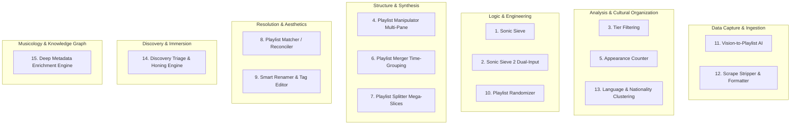

# 🎧 Playlist Haven — Comprehensive System & Architecture Brief

> *"To have your art on the wall is to experience it. To find your art is to use the discovery engine; to stop there is to put it in the attic. To use the experience engine is to put your art on your wall and live with it."*

---

## 1. Project Overview & Philosophy

**Playlist Haven** is a client-side, local-first audio playlist workbench and the concrete manifestation of the **Experience Engine**. It is designed for audiophiles, independent curators, and power listeners who refuse algorithmic feed fatigue and demand desktop-grade autonomy over their music libraries.

### Core Ideology:
- **Discovery Engine vs. Experience Engine**: Mainstream streaming platforms (Spotify, Apple Music, YouTube Music) hyper-optimize for the *Discovery Engine*—serving disposable, short-play novelty driven by algorithmic recommendations. Playlist Haven champions the *Experience Engine*—treating music as enduring art meant to be cultivated, sieved, archived, and actively experienced over time.
- **The DAESO Curation Cycle**:
  $$\text{Data} \longrightarrow \text{Analyze} \longrightarrow \text{Engineer} \longrightarrow \text{Systemize} \longrightarrow \text{Optimize} \longrightarrow \text{Data}$$
- **Anti-Genre Philosophy**: Rejects arbitrary, monolithic Western genre classification (e.g., "World Music", "Pop") in favor of authentic **spoken language and cultural origin/nationality** (Naija, J-Pop, K-Pop, C-Pop, I-Pop, Français, Filipino, Latina, African, English).
- **The Streaming Bridge**: Serves as a bidirectional bridge that extends desktop power tools to live streaming walled gardens via portable UTF-8 BOM CSV/M3U exports.

---

## 2. Technical Stack & Deployment Architecture

Playlist Haven operates on a **100% Zero-Backend, Client-Side SPA Architecture**:

| Layer | Technology |
| :--- | :--- |
| **Frontend Framework** | React 18 + TypeScript + Vite |
| **Styling & Design System** | Tailwind CSS (Dark Audiophile Slate theme) + Lucide React Icons |
| **Mobile / Native** | Capacitor 8 (Android build with native filesystem & sharing plugins) |
| **Concurrency & Workers** | Web Workers for heavy Jaro-Winkler fuzzy math & dataset deduplication |
| **AI Subsystem** | Google GenAI SDK (`gemini-2.5-flash` Primary, `gemini-2.0-flash` Secondary) + OpenAI-compatible Local Endpoints (Ollama / LM Studio) |
| **File Serialization** | `jszip` (ZIP packaging) + `file-saver` + Browser `Blob` streaming with UTF-8 BOM (`\uFEFF`) |
| **Hosting & CI/CD** | Vercel Static Hosting (100% client-side, zero server dependencies, global CORS) |

---

## 3. The 15 Specialized Modules



---

### Module 1: 🎛️ Sonic Sieve Logic Engine (`SonicSieveView.tsx`)
- **Purpose**: Generates weekly rotating top-tier playlists based on historical listening data.
- **Key Features**:
  - Ingests Musicolet `Songs.csv` or standard `.m3u`/`.m3u8` playlists.
  - Mathematical play count threshold filter (e.g., $\ge 2$ plays).
  - **Skeleton Anchor**: Resolves rating ties by preserving the structural sequence of the previous week's playlist so listening memory isn't disrupted.
  - Auto-increments naming convention: `Most played Songs • Week 18 - 2026.m3u` $\rightarrow$ `Week 19 - 2026 (Count).csv`.
  - Penalty list ingestion (deducts play points for recent rotation exclusions).

---

### Module 2: 🧪 Sonic Sieve 2 — Dual Input Engine (`SonicSieveView2.tsx`)
- **Purpose**: Dual-playlist comparative siever.
- **Key Features**:
  - Compares an active library against a reference base.
  - Automatically calculates target playlist capacities and resolves differential play frequencies.

---

### Module 3: 📊 Tier Filtering Workbench (`TierFilteringView.tsx`)
- **Purpose**: Slices vast music libraries into strict statistical tiers.
- **Key Features**:
  - Segregates tracks into discrete listening tiers (Tier 1: Heavy Rotation, Tier 2: Moderate, Tier 3: Exploration).
  - Visual distribution charts and instant sub-playlist exports.

---

### Module 4: 🪟 Playlist Manipulator — Quad Multi-Pane (`PlaylistManipulatorView.tsx`)
- **Purpose**: High-power multi-list organizer and cross-playlist deduplicator.
- **Key Features**:
  - Supports **Single, Dual, and 4-Pane Quad Views** side-by-side.
  - Drag-and-drop track reordering between panes.
  - **Fuzzy Cross-Pruner**: Detects and purges duplicate tracks across open lists using Jaro-Winkler bigram similarity.
  - Mathematical Set Operations: Union, Intersection, and Difference between playlists.

---

### Module 5: 📈 Track Appearance Frequency Counter (`PlaylistAppearanceView.tsx`)
- **Purpose**: Historical listening audit across months or years of archived playlists.
- **Key Features**:
  - Ingests dozens of historical `.m3u` files at once.
  - Computes exact occurrence frequency per song.
  - Identifies "Immortal Favorites" vs. "One-Week Wonders" with interactive heatmaps and CSV reports.

---

### Module 6: 🧬 Playlist Merger & Time-Grouping (`PlaylistMergerView.tsx`)
- **Purpose**: Combines multiple playlists into consolidated temporal archives.
- **Key Features**:
  - Automated grouping by timeframe: **Weekly $\rightarrow$ Monthly $\rightarrow$ Yearly** archives.
  - Configurable deduplication strategies (Keep First, Keep Highest Quality, Append All).

---

### Module 7: ✂️ Playlist Splitter & Decomposer (`PlaylistSplitterView.tsx`)
- **Purpose**: Decomposes mega-playlists (2,000+ tracks) into digestible chapters.
- **Key Features**:
  - Split by track count (e.g., 50 songs per chapter), target duration, or file size.
  - Sequential numbered naming (`Part 1`, `Part 2`, etc.).

---

### Module 8: 🔍 Playlist Matcher & Local Reconciler (`PlaylistMatcherView.tsx`)
- **Purpose**: Bridges cloud/shared text tracklists to physical offline audio files.
- **Key Features**:
  - Takes online song titles (Spotify/YouTube scrapes) and searches local storage directories.
  - Jaro-Winkler similarity fuzzy matching to locate the exact `.mp3`/`.flac` file.
  - Exports a valid, locally playable `.m3u` with absolute physical file paths.

---

### Module 9: 🏷️ Smart Renamer & Tag Normalizer (`SmartRenamerView.tsx`)
- **Purpose**: Aesthetic cleanup and metadata sanitization.
- **Key Features**:
  - Strips noisy download tags, brackets, resolution indicators (`[1080p]`, `(Official Video)`).
  - Smart Title Case with acronym preservation (`DJ`, `MC`, `OST`, `REMIX`, `MV`).

---

### Module 10: 🎲 Intelligent Playlist Randomizer (`PlaylistRandomizerView.tsx`)
- **Purpose**: Serendipitous shuffling with anti-clustering constraints.
- **Key Features**:
  - Shuffles tracks while enforcing **Artist Separation Spacing** (no consecutive songs by the same artist).
  - Configurable bias weighting.

---

### Module 11: 👁️ Vision-to-Playlist AI Digitize (`VisionToPlaylistView.tsx`)
- **Purpose**: Ingests playlist screenshots (Instagram stories, Spotify screenshots, tracklists) into playable files.
- **Key Features**:
  - Cloud Backend: Gemini Vision OCR (`gemini-2.5-flash` Primary, `gemini-2.0-flash` Secondary).
  - Local Backend: **100% Offline Local AI** via Ollama / LM Studio (e.g. `llama3.2-vision`).
  - Auto-deduplicates detected tracks and exports `.m3u` / `.csv`.

---

### Module 12: 🪄 Scrape Stripper & Formatter (`ScrapeStripperView.tsx`)
- **Purpose**: Cleans messy raw text dumps from YouTube channels or playlist pages.
- **Key Features**:
  - Auto-truncates YouTube recommendation noise (`Recommended videos`, `You might also like`).
  - Feature Artist Normalizer (`feat.` $\rightarrow$ Artist column).
  - 1-Click **Swap Artist ↔ Title** (vital for CJK/Bella Ping channels).
  - UTF-8 BOM CSV, TSV, TXT, and M3U exports for 1-click import into Tune My Music.

---

### Module 13: 🌐 Language & Nationality Clustering Engine (`LanguageClusteringView.tsx`)
- **Purpose**: Intelligently partitions massive libraries by artist spoken language and cultural nationality.
- **Key Features**:
  - **Speed-First 5-Tier Waterfall Architecture**:
    1. **Tier 0 (Pre-Seeded Cache)**: 1,341 verified baseline artist mappings loaded in `<100ms` with delimiter splitting (`Wizkid, Skepta` or `Ado ft. Vaundy`).
    2. **Tier 1 (Unicode Script Histogram)**: Deterministic offline regex detecting Han (Chinese), Kana (Japanese), Hangul (Korean), and Devanagari (Indian).
    3. **Tier 2 (MusicBrainz API)**: Queries rate-throttled official API for artist ISO country codes (`TW`, `KR`, `NG`, `GB`, `US`, `FR`, `BR`, `IN`, `PH`, `ES`).
    4. **Tier 3 (Gemini 2.5 Flash Batch AI)**: High-speed batch classification (30 artists/call) with 429 quota backoff, jitter, and **`⚡ Skip to AI`** accelerator.
    5. **Tier 4 (Manual Override)**: 1-click badge reassignment permanently stored in `localStorage`.
  - **20 Canonical Buckets**: English, J-Pop, Naija, K-Pop, C-Pop, Thai, Vietnamese, Dutch, Arabic, German, Italian, Portuguese / Brazilian, Filipino, I-Pop, African, Latina, Français, Gospel, Instrumental, Other.
  - **Export Suite**: Individual bucket playlists, All-in-One multi-playlist **ZIP Archive**, Enriched CSV with UTF-8 BOM.

---

### Module 14: 🧭 Discovery Triage & Honing Engine (`DiscoveryTriageView.tsx`)
- **Purpose**: The architectural bridge between ephemeral streaming discovery and deep, multi-month offline immersion.
- **Key Features**:
  - **Tri-Philosophy Framework**: Partitions discovery cohorts into **Singles (The Probe)**, **Artists (The Resonance: Magnet Artists $\ge 4$ vs Emerging Sparks 2–3)**, and **Albums (The Validation Gate $\ge 2$ tracks)**.
  - **Multi-Source Ingestion & Overlap Matrix**: Ingests Spotify and YouTube Music CSVs simultaneously with automatic MV tag stripping and provenance badges.
  - **Immersion Staging Basket**: Multi-format download carts (Downloader Query TXT for yt-dlp/SpotDL, TuneMyMusic CSV, and playable Musicolet M3U).
  - **AI Taste Intelligence Console**: Gemini 2.5 Flash / local LLM synthesis for cohort soundscapes and 1-click Artist Discography Scouts.

---

### Module 15: 🧬 Deep Metadata Enrichment Engine (`DeepMetadataEnrichmentView.tsx`)
- **Purpose**: Connects music libraries to the global open music knowledge graph (MusicBrainz Web Service v2, Cover Art Archive, and Wikidata) with strict rate-limiting ($\ge 1150\text{ms}$).
- **Key Features**:
  - **Decoupled 2-Stage Pipeline**: Stage 1 non-blocking primary ingestion loop running unhindered at 1 req/sec directly to 100% completion; followed by batched Stage 2 AI Remediation.
  - **Two-Fold AI Remediation Architecture**:
    - **Fold 1: AI Precision Query Surgeon + MusicBrainz Retry**: Uses **Gemini 2.5 Flash** (Primary) with automatic **Gemini 2.0 Flash** failover to diagnose distorted tags, isolate canonical artist/title syntax, and re-query MusicBrainz.
    - **Fold 2: AI Musicological Fallback Synthesis**: Synthesizes rich structured fallback metadata for true 0-result candidates with explicit `⚠️ AI Fallback (Not on MusicBrainz)` badge.
  - **Multi-Step Search & Resilient String Matching**: Unicode hyphen (`\u2010`–`\u2014`) and quote normalization, dual-title evaluation against raw and clean titles (protecting `- Remix` versions), and direct 1-request search parsing.
  - **Persistent IndexedDB Architecture & Strict Persistence Guard**: Browser database (`PlaylistHavenMetadataDB` v1) with compound key normalization (`artist:::title`). Failed/unresolved tracks are **strictly never persisted to IndexedDB**. Active `purgeUnresolvedTracks()` hygiene routine.
  - **Slide-Over Musicological Dossier**: Interactive drawer with high-resolution artwork, MBID hyperlinks, songwriting credits, artist biography, and streaming links.
  - **Dense Multi-Format Exporters**: 38-Column UTF-8 BOM CSV, Master Dataset JSON, Tagged M3U8, and Downloader TXT.

---

## 4. Supported Data Formats & Protocols

1. **M3U / M3U8 Extended Playlists**:
   ```m3u
   #EXTM3U
   #EXTINF:215,Burna Boy - Last Last
   /storage/emulated/0/Music/Burna Boy - Last Last.mp3
   ```
2. **Musicolet Songs.csv**:
   ```csv
   "FILE_PATH","PLAY_COUNT","TITLE","ARTIST","ALBUM"
   "/storage/emulated/0/Music/track1.mp3","14","Track 1","Artist Name","Album"
   ```
3. **Plain Text Tracklists**:
   ```text
   Artist Name - Song Title
   Another Artist - Another Song
   ```
4. **UTF-8 Byte Order Mark (`\uFEFF`)**:
   - Injected into all CSV/TSV exports to guarantee Excel and third-party tools render Chinese, Japanese, Korean, and accented characters without mojibake/corruption.

---

## 5. UI/UX & Design System Guidelines

- **Palette**: Dark Audiophile aesthetic.
  - Background: Deep Slate-950 (`#020617`) with subtle glassmorphic slate-900 panels (`#0f172a / 60%`).
  - Accents: **Cyan-400 / Blue-500** (Primary actions), **Purple-400** (AI & Vision), **Emerald-400** (Success & Cache), **Rose-500** (Alerts & Cancellations), **Amber-400** (Warnings & Substack).
- **Typography**: Inter / system sans with monospace font for track counts, confidence badges, and model identifiers.
- **Interactions**:
  - Global Help Guide Modal accessible via header button or <kbd>?</kbd> shortcut.
  - Real-time animated multi-tier progress bars with granular tier color coding.
  - Inline 1-click badge overrides and responsive table grids.
